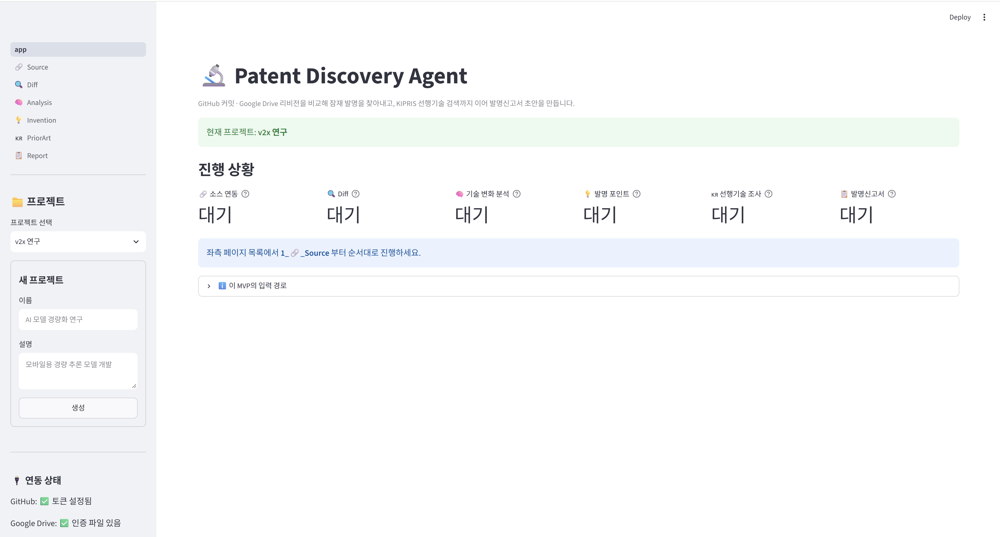

# 🔬 Patent Discovery Agent

연구 산출물(GitHub 커밋, 연구보고서, PT 등)의 **버전 간 변화**를 분석해 잠재 발명을 찾아내고,
**KIPRIS 선행기술 검색**까지 이어 **발명신고서 초안**을 자동 생성하는 AI Agent입니다.

> 2026 AID-X 해커톤 출품작

| 링크 | 설명 |
|------|------|
| [프로젝트 노션](https://app.notion.com/p/2026-AID-X-3e2801e2dcae801bbdfde7913cf6db40) | 기획 배경, 문제 정의, 진행 기록 |
| [데모 데이터 저장소](https://github.com/shyun0001/patent_discovery) | 에이전트가 **분석하는 대상** — 40개 연구 프로젝트가 연구 단계별 8개 커밋으로 누적 |
| [변경 이력](CHANGELOG.md) | 개발 과정에서의 주요 변경과 수정 내역 |



```
GitHub 커밋 / Drive 리비전 2개 선택
        ↓  (자동 수집 — 수동 업로드 없음)
    텍스트 추출 → Diff 생성 (로컬, 무료)
        ↓
    기술 변화 분석 (LLM)
        ↓
    발명 포인트 도출 · 과제/수단/효과 구조화 (LLM)
        ↓
    KIPRIS 선행기술 검색 (무료 API) → 유사도·차별점 평가 (LLM)
        ↓
    발명신고서 초안 (.md / .docx)
```

## 특징

- **문서 입력은 연동만**: GitHub REST API v3, Google Drive API v3. 수동 파일 업로드는 제공하지 않습니다.
- **지원 포맷**: `.md`, `.txt`, `.pdf`, `.pptx`, `.docx` (DOCX는 문단과 표를 함께 읽습니다)
- **선행기술 검색은 국내 한정**: KIPRIS Plus OpenAPI(특허/실용신안). USPTO·Google Patents 등 해외 DB는 조회하지 않습니다(영문 검색어는 신고서 참고용).
- **발명신고서**: 특허팀 실무 양식(핵심 기술구성 표·동작흐름·선행기술 비교·청구항 초안·확인 필요사항 13개 섹션)으로 LLM이 본문을 작성하고, 머리말과 근거 부록은 시스템이 실제 수집 기록에서 생성합니다. 구성요소마다 `[E1] 문서구간` 형식으로 근거 위치가 인용됩니다.
- **비용 최소화**: Diff는 로컬 `difflib`, 소스 파일·LLM 응답·KIPRIS 응답을 모두 SQLite/파일로 캐싱합니다. 같은 입력을 재분석하면 API 호출이 발생하지 않습니다.
- **데모 안전장치**: KIPRIS Service Key가 없으면 샘플 XML로 동작하는 오프라인 모드로 자동 전환되며, 화면에 "샘플 데이터" 배지가 표시됩니다.

## 설치

```bash
pip install -r requirements.txt
cp .env.example .env     # Windows: copy .env.example .env
python -m db.init_db
```

## 환경변수 (.env)

| 키 | 설명 |
|----|------|
| `OPENAI_API_KEY` | LLM 호출용 (필수) |
| `GITHUB_TOKEN` | repo 읽기 권한이 있는 Personal Access Token |
| `GDRIVE_CREDENTIALS_PATH` | 서비스 계정 키 또는 OAuth 클라이언트 시크릿 경로 |
| `KIPRIS_SERVICE_KEY` | KIPRIS Plus Service Key (없으면 오프라인 모드) |
| `KIPRIS_MAX_RESULTS` | 유사도 평가 대상 상위 N건 (기본 10) |
| `KIPRIS_OFFLINE` | `true`면 실제 호출 없이 샘플 응답 사용 |

### 키 발급 방법

- **GitHub PAT**: Settings → Developer settings → Personal access tokens → `repo` (private) 또는 `public_repo` 권한으로 생성
- **Google Drive**: Google Cloud Console에서 프로젝트 생성 → Drive API 사용 설정 → 서비스 계정 키(JSON) 발급 후 `data/credentials/service_account.json`에 저장 → 분석할 Drive 폴더를 서비스 계정 이메일과 공유
- **KIPRIS**: [plus.kipris.or.kr](https://plus.kipris.or.kr) 회원가입 → 특허/실용신안 검색 서비스 신청 → 발급된 Service Key 사용 (무료, 일일 호출 한도 있음)

> ⚠️ 오퍼레이션명·응답 필드명은 KIPRIS Plus 계정 발급 시 제공되는 API 명세서 기준으로 확인하세요.
> 응답 매핑은 `patent/kipris_client.py`의 `_normalize_item()` 한 곳에만 있으므로, 다를 경우 여기만 수정하면 됩니다.

## 실행

```bash
streamlit run app.py
```

홈에서 프로젝트를 만든 뒤, 좌측 페이지를 순서대로 진행합니다.

| 페이지 | 하는 일 |
|--------|---------|
| 1 🔗 Source | GitHub 저장소 연결 → 파일·커밋 선택, 또는 Drive 폴더 → 파일·리비전 선택 |
| 2 🔍 Diff | 변경률·변경 섹션·unified diff 확인 |
| 3 🧠 Analysis | AI가 분류한 기술 변화 중 발명 후보 선택 |
| 4 💡 Invention | 과제/수단/효과 구조화 + KIPRIS 검색어·IPC 코드 생성 |
| 5 🇰🇷 PriorArt | KIPRIS 검색 결과, 유사도·중복/차별점, 종합 위험도 |
| 6 📋 Report | 13개 섹션 발명신고서 초안 (본문 편집·재작성·다운로드) |

## 데모 데이터

에이전트가 분석할 연구 산출물은 별도 저장소에 있습니다 —
**[shyun0001/patent_discovery](https://github.com/shyun0001/patent_discovery)**

- 통신·배터리·반도체·바이오 4개 분야 **40개 연구 프로젝트** (합성 데이터)
- 각 프로젝트의 산출물이 연구 진행 단계에 따라 **8개 커밋**으로 나뉘어 있습니다
  (`00_initiation` → `01_planning` → ... → `07_completion`)
- 각 프로젝트 폴더의 `technical_report.md` 가 커밋마다 내용이 누적되는 **비교 대상** 문서입니다
- 평가용 정답 데이터(`_ground_truth`)는 공정성을 위해 저장소에 포함하지 않았습니다

| 커밋 | 단계 | 추가되는 산출물 |
|------|------|-----------------|
| 1 | 00_initiation | 문제 정의, 선행 관찰 |
| 2 | 01_planning | 연구계획, 요구조건, 시료·장비 목록 |
| 3 | 02_meetings | 착수·설계검토·이슈검토 회의록 |
| 4 | 03_design | 프로토타입 상세 설계, 시험 매트릭스, 위험관리 |
| 5 | 04_experiments | 기준선 → 1·2차 반복 → 독립 검증 |
| 6 | 05_data | 실험 원자료(csv), 실행 메타데이터 |
| 7 | 06_analysis | 분석 코드, 결과 해석 |
| 8 | 07_completion | 최종 기술보고, 이관 기록 |

## 데모 시나리오

1. **1 🔗 Source** — 저장소 `shyun0001/patent_discovery` 연결 후,
   파일 경로 검색에 `1020180073423` 을 넣고
   `projects/communication/1020180073423B1(3).pdf/technical_report.md` 를 선택합니다.
2. 커밋 2개를 고릅니다.
   - 이전: `docs: 문제 정의와 선행 관찰 기록` (00_initiation)
   - 변경: `feat: 프로토타입 상세 설계와 시험 매트릭스 확정` (03_design)
3. **2 🔍 Diff** — 변경률 45.2%, 설계 구간 6개 섹션 추가를 확인하고 기술 변화 분석 실행.
4. **3 🧠 Analysis** — `algorithm` 유형의 "V2X 서비스 타입 분류 및 RAT 후보 평가 알고리즘 추가"
   (유의미성 0.85)를 선택 → 발명 포인트 도출.
5. **4 💡 Invention** — 과제·수단·효과 구조화, 검색어 `V2X 서비스 타입 분류 알고리즘` 생성.
6. **5 🇰🇷 PriorArt** — KIPRIS 검색 → 한국전자기술연구원 "서비스 맞춤형 V2X 지원 시스템"
   (유사도 0.60, MEDIUM) 등 국내 특허 5건과 차별점 확인.
7. **6 📋 Report** — 13개 섹션 발명신고서 초안을 확인하고 `.md` / `.docx` 로 다운로드.

## 테스트

```bash
pytest tests -q                    # 전체 (외부 API·LLM 호출 없음)
pytest tests/test_kipris.py -v     # KIPRIS XML 파싱·캐시·오프라인 모드
pytest tests/test_sources.py -v    # GitHub/Drive 커넥터 (API 모킹)
pytest tests/test_pipeline.py -v   # 수집→신고서 전체 파이프라인
pytest tests/test_pages.py -v      # Streamlit 페이지 스모크
```

## 구조

```
app.py                  Streamlit 엔트리포인트 (프로젝트 선택·진행 현황)
ui_state.py             세션 상태 및 에러 표시 헬퍼
pages/                  6개 페이지 (Source → Diff → Analysis → Invention → PriorArt → Report)
sources/                GitHubConnector, GDriveConnector (SourceConnector 추상화)
patent/                 KiprisClient, 특허 데이터 모델
core/                   parser, differ, analyzer, inventor, searcher, prior_art, writer, reporter, pipeline
llm/                    LLMClient(캐싱·재시도), PromptManager, 발명신고서 작성 프롬프트
db/                     SQLite 스키마·모델·CRUD
templates/              발명신고서 양식 (LLM 작성 실패 시 폴백용)
tests/                  단위·파이프라인·페이지 테스트 + fixtures
```

설계 문서: [docs/implementation_plan.md](docs/implementation_plan.md) (범위·아키텍처·데이터모델·태스크),
[docs/implementation_detail.md](docs/implementation_detail.md) (API 스키마·프롬프트 전략·예외·비용·테스트)

## 참고

- 생성되는 발명신고서는 **AI 초안**이며, 선행기술 조사 결과는 KIPRIS 키워드 검색 기반입니다. 정식 선행기술조사나 변리사 검토를 대체하지 않습니다.
- `data/` 디렉터리(로컬 DB, 캐시, 인증 토큰)와 `.env`는 `.gitignore` 대상입니다.
