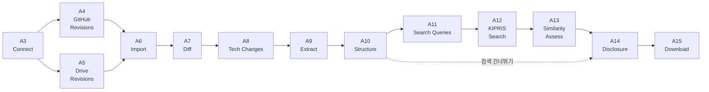
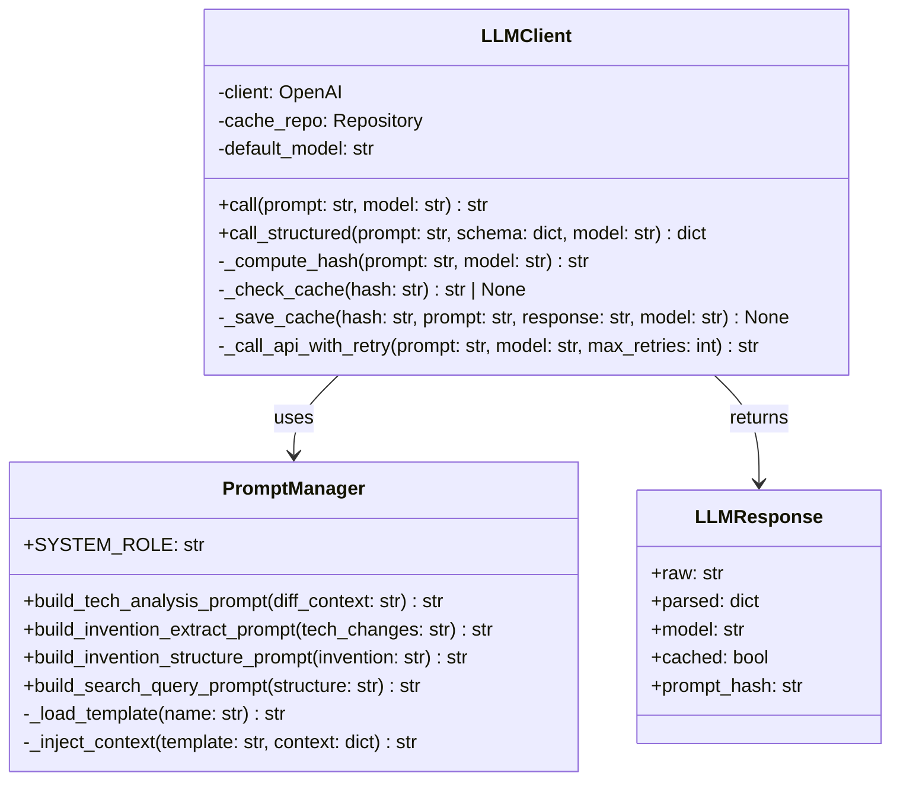
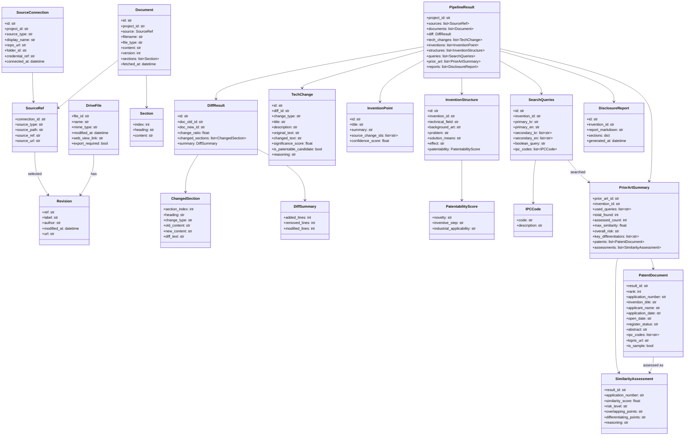
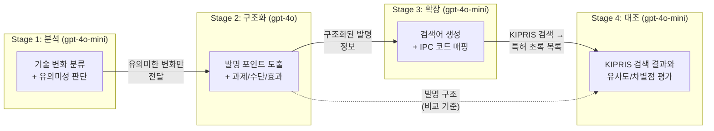
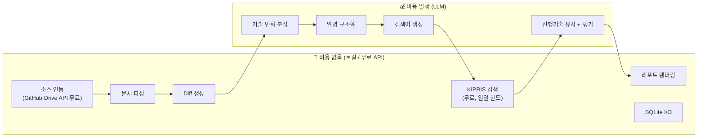

# Patent Discovery Agent — MVP 구현 상세 명세서

> 이전 설계 문서([implementation_plan.md](file:///C:/Users/admin/.gemini/antigravity/brain/9c6a1d82-9fef-47fa-b5bf-2dbf317c5534/implementation_plan.md))를 기반으로 한 구현 수준 상세 명세

---

## 1. API 목록

Streamlit 프론트엔드가 내부적으로 호출하는 서비스 레이어 API입니다.  
향후 FastAPI 전환 시 그대로 REST 엔드포인트로 노출 가능하도록 REST 규약으로 정의합니다.

### 1.1 엔드포인트 총괄

| # | Method | Endpoint | 설명 | 모듈 |
|---|--------|----------|------|------|
| A1 | `POST` | `/api/projects` | 프로젝트 생성 | DB |
| A2 | `GET` | `/api/projects` | 프로젝트 목록 조회 | DB |
| A3 | `POST` | `/api/sources/connect` | 소스 연결 (GitHub 레포 / Drive 폴더) 검증 & 등록 | Connector |
| A4 | `GET` | `/api/sources/github/revisions` | 레포 파일 목록 / 커밋 목록 조회 | GitHubConnector |
| A5 | `GET` | `/api/sources/gdrive/revisions` | Drive 폴더 파일 목록 / 리비전 목록 조회 | GDriveConnector |
| A6 | `POST` | `/api/documents/import` | 선택한 리비전 2개를 수집 → Document 생성 | Connector + Parser |
| A7 | `POST` | `/api/diff` | 두 문서 비교 (Diff 생성) | DiffEngine |
| A8 | `POST` | `/api/analysis/tech-changes` | 기술 변화 분석 (LLM) | Analyzer |
| A9 | `POST` | `/api/invention/extract` | 발명 포인트 도출 (LLM) | Inventor |
| A10 | `POST` | `/api/invention/structure` | 과제/수단/효과 구조화 (LLM) | Inventor |
| A11 | `POST` | `/api/search/queries` | 선행기술 검색어 생성 (LLM) | Searcher |
| A12 | `POST` | `/api/prior-art/search` | KIPRIS 선행기술 검색 | KiprisClient |
| A13 | `POST` | `/api/prior-art/assess` | 선행기술 유사도 평가 (LLM) | PriorArtAnalyzer |
| A14 | `POST` | `/api/report/disclosure` | 발명신고서 초안 생성 | Reporter |
| A15 | `GET` | `/api/report/{report_id}/download` | 발명신고서 다운로드 (.md) | Reporter |

> [!NOTE]
> 파일 업로드(`multipart/form-data`) 엔드포인트는 존재하지 않습니다. 문서는 항상 GitHub 또는 Google Drive 연동을 통해서만 수집됩니다.
> 특허 검색 대상은 **KIPRIS(국내 특허/실용신안)로 한정**합니다. USPTO·Google Patents 등 해외 DB 엔드포인트는 두지 않습니다.

### 1.2 파이프라인 호출 순서



---

## 2. Request / Response Schema

### A1 — 프로젝트 생성

```
POST /api/projects
```

**Request:**
```json
{
  "name": "AI 모델 경량화 연구",
  "description": "모바일용 경량 추론 모델 개발 프로젝트"
}
```

**Response (201):**
```json
{
  "project_id": "proj_a1b2c3d4",
  "name": "AI 모델 경량화 연구",
  "description": "모바일용 경량 추론 모델 개발 프로젝트",
  "created_at": "2026-09-21T14:00:00+09:00"
}
```

---

### A2 — 프로젝트 목록 조회

```
GET /api/projects
```

**Response (200):**
```json
{
  "projects": [
    {
      "project_id": "proj_a1b2c3d4",
      "name": "AI 모델 경량화 연구",
      "sources": [
        { "connection_id": "src_g1h2i3", "source_type": "github", "display_name": "acme-lab/model-compression" },
        { "connection_id": "src_j4k5l6", "source_type": "gdrive", "display_name": "연구자료/모델경량화" }
      ],
      "document_count": 4,
      "last_analysis_at": "2026-09-21T14:00:00+09:00",
      "created_at": "2026-09-20T10:00:00+09:00"
    }
  ]
}
```

---

### A3 — 소스 연결

```
POST /api/sources/connect
```

**Request (GitHub):**
```json
{
  "project_id": "proj_a1b2c3d4",
  "source_type": "github",
  "repo_url": "https://github.com/acme-lab/model-compression",
  "token": "ghp_****"
}
```

**Request (Google Drive):**
```json
{
  "project_id": "proj_a1b2c3d4",
  "source_type": "gdrive",
  "folder_id": "1A2b3C4d5E6f7G8h9I0j",
  "auth_mode": "service_account"
}
```

**Response (201):**
```json
{
  "connection_id": "src_g1h2i3",
  "project_id": "proj_a1b2c3d4",
  "source_type": "github",
  "display_name": "acme-lab/model-compression",
  "default_branch": "main",
  "authenticated": true,
  "rate_limit": {
    "limit": 5000,
    "remaining": 4892,
    "reset_at": "2026-09-21T15:00:00+09:00"
  },
  "connected_at": "2026-09-21T14:01:00+09:00"
}
```

---

### A4 — GitHub 리비전 조회

```
GET /api/sources/github/revisions?connection_id=src_g1h2i3&path=docs/research_report.md
```

`path`를 생략하면 분석 가능한 파일 목록(`files`)만 반환하고, `path`가 있으면 해당 파일의 커밋 목록(`revisions`)을 반환합니다.

**Response (200):**
```json
{
  "connection_id": "src_g1h2i3",
  "files": [
    "docs/research_report.md",
    "docs/architecture.md",
    "README.md"
  ],
  "path": "docs/research_report.md",
  "revisions": [
    {
      "ref": "e4f5g6h7i8j9k0l1m2n3o4p5q6r7s8t9",
      "label": "feat: AdamW 옵티마이저 및 코사인 어닐링 도입",
      "author": "hyeonjin",
      "modified_at": "2026-09-19T11:20:00+09:00",
      "url": "https://github.com/acme-lab/model-compression/blob/e4f5g6h/docs/research_report.md"
    },
    {
      "ref": "a1b2c3d4e5f6g7h8i9j0k1l2m3n4o5p6",
      "label": "docs: 학습 파이프라인 초안 작성",
      "author": "hyeonjin",
      "modified_at": "2026-09-10T09:05:00+09:00",
      "url": "https://github.com/acme-lab/model-compression/blob/a1b2c3d/docs/research_report.md"
    }
  ]
}
```

---

### A5 — Google Drive 리비전 조회

```
GET /api/sources/gdrive/revisions?connection_id=src_j4k5l6&file_id=1XyZ...
```

`file_id`를 생략하면 폴더 내 파일 목록(`files`)을, 지정하면 해당 파일의 리비전 목록(`revisions`)을 반환합니다.

**Response (200):**
```json
{
  "connection_id": "src_j4k5l6",
  "files": [
    {
      "file_id": "1XyZaBcDeFgHiJkLmNoPqRsTuVwXyZ",
      "name": "연구보고서_모델경량화.pptx",
      "mime_type": "application/vnd.openxmlformats-officedocument.presentationml.presentation",
      "modified_at": "2026-09-19T18:00:00+09:00",
      "web_view_link": "https://drive.google.com/file/d/1XyZ.../view",
      "export_required": false
    }
  ],
  "file_id": "1XyZaBcDeFgHiJkLmNoPqRsTuVwXyZ",
  "revisions": [
    {
      "ref": "0B3n5KpQ2",
      "label": "리비전 2 (2026-09-19)",
      "author": "수현",
      "modified_at": "2026-09-19T18:00:00+09:00"
    },
    {
      "ref": "0B1a2BcD3",
      "label": "리비전 1 (2026-09-10)",
      "author": "수현",
      "modified_at": "2026-09-10T10:30:00+09:00"
    }
  ]
}
```

---

### A6 — 문서 수집 (Import)

```
POST /api/documents/import
```

선택한 두 리비전을 소스에서 직접 다운로드하여 파싱합니다. GitHub은 `source_path`가 레포 내 경로 + `source_ref`가 커밋 SHA, Drive는 `source_path`가 파일 ID + `source_ref`가 리비전 ID입니다.

**Request:**
```json
{
  "project_id": "proj_a1b2c3d4",
  "connection_id": "src_g1h2i3",
  "old": {
    "source_path": "docs/research_report.md",
    "source_ref": "a1b2c3d4e5f6g7h8i9j0k1l2m3n4o5p6"
  },
  "new": {
    "source_path": "docs/research_report.md",
    "source_ref": "e4f5g6h7i8j9k0l1m2n3o4p5q6r7s8t9"
  }
}
```

**Response (201):**
```json
{
  "documents": [
    {
      "document_id": "doc_x1y2z3",
      "version": 1,
      "source_type": "github",
      "source_path": "docs/research_report.md",
      "source_ref": "a1b2c3d4e5f6g7h8i9j0k1l2m3n4o5p6",
      "source_url": "https://github.com/acme-lab/model-compression/blob/a1b2c3d/docs/research_report.md",
      "filename": "research_report.md",
      "file_type": "md",
      "content_preview": "# AI 모델 경량화 연구 보고서\n\n## 1. 개요...",
      "section_count": 8,
      "char_count": 12450,
      "fetched_at": "2026-09-21T14:02:00+09:00",
      "cache_hit": false
    },
    {
      "document_id": "doc_a4b5c6",
      "version": 2,
      "source_type": "github",
      "source_path": "docs/research_report.md",
      "source_ref": "e4f5g6h7i8j9k0l1m2n3o4p5q6r7s8t9",
      "source_url": "https://github.com/acme-lab/model-compression/blob/e4f5g6h/docs/research_report.md",
      "filename": "research_report.md",
      "file_type": "md",
      "content_preview": "# AI 모델 경량화 연구 보고서\n\n## 1. 개요...",
      "section_count": 9,
      "char_count": 15870,
      "fetched_at": "2026-09-21T14:02:01+09:00",
      "cache_hit": false
    }
  ]
}
```

---

### A7 — 문서 비교 (Diff)

```
POST /api/diff
```

**Request:**
```json
{
  "doc_old_id": "doc_x1y2z3",
  "doc_new_id": "doc_a4b5c6"
}
```

**Response (200):**
```json
{
  "diff_id": "diff_m1n2o3",
  "change_ratio": 0.32,
  "total_sections": 8,
  "changed_sections_count": 3,
  "changed_sections": [
    {
      "section_index": 2,
      "heading": "## 3. 학습 알고리즘",
      "change_type": "modified",
      "old_content": "기존 SGD 옵티마이저를 사용하여...",
      "new_content": "AdamW 옵티마이저와 코사인 어닐링 스케줄러를 결합하여...",
      "diff_text": "- 기존 SGD 옵티마이저를 사용하여...\n+ AdamW 옵티마이저와 코사인 어닐링 스케줄러를 결합하여..."
    }
  ],
  "diff_summary": {
    "added_lines": 45,
    "removed_lines": 12,
    "modified_lines": 23
  }
}
```

---

### A8 — 기술 변화 분석

```
POST /api/analysis/tech-changes
```

**Request:**
```json
{
  "diff_id": "diff_m1n2o3",
  "significance_threshold": 0.5
}
```

**Response (200):**
```json
{
  "analysis_id": "anal_p1q2r3",
  "diff_id": "diff_m1n2o3",
  "tech_changes": [
    {
      "change_id": "tc_001",
      "change_type": "algorithm",
      "title": "옵티마이저 교체 및 학습률 스케줄링 전략 변경",
      "description": "SGD에서 AdamW로 옵티마이저를 교체하고, 코사인 어닐링 스케줄러를 도입하여 학습 안정성과 수렴 속도를 개선",
      "original_text": "기존 SGD 옵티마이저를 사용하여...",
      "changed_text": "AdamW 옵티마이저와 코사인 어닐링 스케줄러를 결합하여...",
      "significance_score": 0.85,
      "is_patentable_candidate": true,
      "reasoning": "단순 파라미터 변경이 아닌 옵티마이저 아키텍처 자체의 변경이며, 특정 도메인에 맞춘 스케줄링 전략이 결합되어 기술적 진보성이 있음"
    }
  ],
  "filtered_count": 3,
  "total_count": 5,
  "cache_hit": false
}
```

---

### A9 — 발명 포인트 도출

```
POST /api/invention/extract
```

**Request:**
```json
{
  "analysis_id": "anal_p1q2r3",
  "selected_change_ids": ["tc_001", "tc_003"]
}
```

**Response (200):**
```json
{
  "invention_points": [
    {
      "invention_id": "inv_s1t2u3",
      "title": "도메인 특화 적응형 학습률 스케줄링 방법",
      "summary": "모바일 디바이스용 경량 모델 학습 시 AdamW 옵티마이저와 코사인 어닐링을 결합한 적응형 학습률 스케줄링으로 수렴 속도 40% 향상",
      "source_change_ids": ["tc_001", "tc_003"],
      "confidence_score": 0.82
    }
  ],
  "cache_hit": false
}
```

---

### A10 — 과제/수단/효과 구조화

```
POST /api/invention/structure
```

**Request:**
```json
{
  "invention_id": "inv_s1t2u3"
}
```

**Response (200):**
```json
{
  "structure_id": "str_v1w2x3",
  "invention_id": "inv_s1t2u3",
  "technical_field": "인공지능 / 기계학습 / 모델 최적화",
  "background_art": "종래의 모바일용 경량 모델 학습에서는 SGD 옵티마이저를 사용하였으나, 학습 초기 불안정성과 긴 수렴 시간이 문제가 되었다.",
  "problem": "모바일 디바이스의 제한된 연산 자원 환경에서 경량 모델을 학습할 때, 기존 SGD 기반 학습 방식은 수렴이 느리고 하이퍼파라미터 튜닝에 많은 비용이 소요되는 문제가 있었다.",
  "solution_means": "본 발명은 AdamW 옵티마이저와 코사인 어닐링 학습률 스케줄러를 결합한 적응형 학습률 스케줄링 방법을 제공한다. 구체적으로, (1) AdamW의 가중치 감쇠 분리 메커니즘을 통해 정규화 효과를 강화하고, (2) 코사인 어닐링을 통해 학습률을 주기적으로 조절하여 지역 최적해 탈출 능력을 향상시킨다.",
  "effect": "본 발명에 의하면, (1) 학습 수렴 속도가 기존 대비 약 40% 향상되고, (2) 하이퍼파라미터 탐색 비용이 60% 절감되며, (3) 최종 모델의 추론 정확도가 2.3%p 향상되는 효과가 있다.",
  "patentability_assessment": {
    "novelty": "HIGH - 특정 도메인(모바일 경량 모델)에 대한 AdamW+코사인 어닐링 결합은 선행기술에서 발견되지 않음",
    "inventive_step": "MEDIUM - 개별 기술은 공지이나, 특정 도메인 맞춤 결합과 그 시너지 효과에 진보성 있음",
    "industrial_applicability": "HIGH - 모바일 AI 서비스에 직접 적용 가능"
  }
}
```

---

### A11 — 선행기술 검색어 생성

```
POST /api/search/queries
```

**Request:**
```json
{
  "invention_id": "inv_s1t2u3"
}
```

**Response (200):**
```json
{
  "query_id": "qry_y1z2a3",
  "invention_id": "inv_s1t2u3",
  "queries": {
    "primary_kr": "모바일 경량모델 적응형 학습률 스케줄링",
    "primary_en": "adaptive learning rate scheduling for mobile lightweight model",
    "secondary_kr": [
      "AdamW 코사인 어닐링 결합 학습 방법",
      "경량 신경망 옵티마이저 최적화"
    ],
    "secondary_en": [
      "AdamW cosine annealing combined training method",
      "lightweight neural network optimizer optimization"
    ],
    "boolean_query": "(adaptive learning rate OR cosine annealing) AND (lightweight model OR mobile) AND (AdamW OR weight decay)",
    "ipc_codes": [
      {
        "code": "G06N 3/084",
        "description": "신경망의 학습 방법"
      },
      {
        "code": "G06N 3/04",
        "description": "신경망의 아키텍처"
      }
    ]
  },
  "cache_hit": false
}
```

---

### A12 — KIPRIS 선행기술 검색

```
POST /api/prior-art/search
```

KIPRIS Plus OpenAPI(`getWordSearch` / `getAdvancedSearch`)를 호출하고, XML 응답을 정규화하여 반환합니다. 동일 검색어의 결과는 `kipris_cache`에서 재사용합니다.

**Request:**
```json
{
  "invention_id": "inv_s1t2u3",
  "query_id": "qry_y1z2a3",
  "query": "모바일 경량모델 적응형 학습률 스케줄링",
  "expand_with_secondary": true,
  "max_results": 10
}
```

| 필드 | 설명 |
|------|------|
| `query` | 생략 시 `query_id`의 `primary_kr` 사용. 사용자가 화면에서 수정한 검색어를 그대로 전달 가능 |
| `expand_with_secondary` | 1차 결과가 5건 미만일 때 `secondary_kr`로 추가 검색할지 여부 |
| `max_results` | 중복 제거 후 유지할 상위 건수 (기본 10, `KIPRIS_MAX_RESULTS`) |

**Response (200):**
```json
{
  "prior_art_id": "pa_c1d2e3",
  "invention_id": "inv_s1t2u3",
  "used_queries": [
    "모바일 경량모델 적응형 학습률 스케줄링",
    "AdamW 코사인 어닐링 결합 학습 방법"
  ],
  "total_found": 37,
  "returned_count": 10,
  "is_sample": false,
  "cache_hit": false,
  "results": [
    {
      "result_id": "par_001",
      "rank": 1,
      "application_number": "1020210012345",
      "invention_title": "학습률 스케줄링을 이용한 신경망 학습 방법 및 장치",
      "applicant_name": "주식회사 ○○테크",
      "application_date": "2021-01-28",
      "open_date": "2022-08-03",
      "register_status": "공개",
      "abstract": "본 발명은 신경망 학습 시 학습률을 주기적으로 조절하는 스케줄링 방법에 관한 것으로...",
      "ipc_codes": ["G06N 3/08", "G06N 3/04"],
      "kipris_url": "https://www.kipris.or.kr/khome/search/detail.do?applicationNumber=1020210012345"
    }
  ]
}
```

**결과 0건 응답 (200):**
```json
{
  "prior_art_id": "pa_c1d2e3",
  "invention_id": "inv_s1t2u3",
  "used_queries": ["모바일 경량모델 적응형 학습률 스케줄링"],
  "total_found": 0,
  "returned_count": 0,
  "results": [],
  "message": "유사 선행기술이 검색되지 않았습니다. 검색어를 완화해 재검색해보세요."
}
```

---

### A13 — 선행기술 유사도 평가

```
POST /api/prior-art/assess
```

검색된 특허의 **초록만** 발명 구조와 함께 LLM에 전달하여 1회 호출로 일괄 평가합니다.

**Request:**
```json
{
  "prior_art_id": "pa_c1d2e3",
  "invention_id": "inv_s1t2u3",
  "result_ids": ["par_001", "par_002", "par_003"]
}
```

**Response (200):**
```json
{
  "assessment_id": "asm_f1g2h3",
  "prior_art_id": "pa_c1d2e3",
  "assessments": [
    {
      "result_id": "par_001",
      "application_number": "1020210012345",
      "invention_title": "학습률 스케줄링을 이용한 신경망 학습 방법 및 장치",
      "similarity_score": 0.72,
      "risk_level": "MEDIUM",
      "overlapping_points": "학습률을 주기적으로 조절하는 스케줄링 구성이 본 발명의 코사인 어닐링 적용과 개념적으로 중첩됨",
      "differentiating_points": "선행문헌은 범용 신경망을 대상으로 하며, 본 발명의 AdamW 가중치 감쇠 분리와 모바일 경량 모델 특화 결합 구성은 포함하지 않음",
      "reasoning": "청구 대상 기술 분야는 동일하나, 옵티마이저 결합 방식과 적용 도메인이 달라 동일 발명으로 보기 어려움"
    }
  ],
  "summary": {
    "total_found": 37,
    "assessed_count": 3,
    "max_similarity": 0.72,
    "overall_risk": "MEDIUM",
    "key_differentiators": [
      "AdamW 가중치 감쇠 분리 + 코사인 어닐링의 결합 구성",
      "모바일 경량 모델이라는 특정 적용 도메인",
      "수렴 속도 40% 향상이라는 정량적 효과"
    ]
  },
  "cache_hit": false
}
```

| `risk_level` | 기준 | UI 표시 |
|--------------|------|---------|
| `HIGH` | `similarity_score >= 0.8` | 🔴 `st.error` — 권리 범위 재설계 검토 필요 |
| `MEDIUM` | `0.5 <= score < 0.8` | 🟡 `st.warning` — 차별점 강조 필요 |
| `LOW` | `score < 0.5` | 🟢 `st.success` — 신규성 확보 가능성 |

---

### A14 — 발명신고서 초안 생성

```
POST /api/report/disclosure
```

**Request:**
```json
{
  "invention_id": "inv_s1t2u3",
  "assessment_id": "asm_f1g2h3",
  "include_prior_art": true,
  "inventor_name": "",
  "inventor_affiliation": ""
}
```

**Response (201):**
```json
{
  "report_id": "rpt_b1c2d3",
  "invention_id": "inv_s1t2u3",
  "report_markdown": "# 발명신고서\n\n## 1. 발명의 명칭\n도메인 특화 적응형 학습률 스케줄링 방법\n\n## 2. 기술 분야\n...",
  "sections": {
    "title": "도메인 특화 적응형 학습률 스케줄링 방법",
    "technical_field": "인공지능 / 기계학습 / 모델 최적화",
    "background_art": "...",
    "problem": "...",
    "solution_means": "...",
    "effect": "...",
    "detailed_description": "...",
    "search_keywords": "...",
    "prior_art": {
      "searched_db": "KIPRIS (국내 특허/실용신안)",
      "used_queries": ["모바일 경량모델 적응형 학습률 스케줄링"],
      "total_found": 37,
      "assessed_count": 3,
      "overall_risk": "MEDIUM",
      "max_similarity": 0.72,
      "table_markdown": "| 출원번호 | 발명의 명칭 | 출원인 | 출원일 | 유사도 |\n|---|---|---|---|---|\n| 1020210012345 | 학습률 스케줄링을 이용한... | 주식회사 ○○테크 | 2021-01-28 | 0.72 |",
      "differentiating_points": "..."
    },
    "inventor_info": "..."
  },
  "prior_art_included": true,
  "generated_at": "2026-09-21T14:10:00+09:00"
}
```

---

### A15 — 발명신고서 다운로드

```
GET /api/report/{report_id}/download?format=md
```

**Response (200):**
```
Content-Type: text/markdown
Content-Disposition: attachment; filename="disclosure_inv_s1t2u3.md"

# 발명신고서
...
```

---

## 3. Python Class Diagram

### 3.1 Core 레이어 — 비즈니스 로직 클래스

```mermaid
classDiagram
    direction TB

    class SourceConnector {
        <<abstract>>
        #cache_dir: str
        +authenticate() bool
        +list_targets() list~str~
        +list_revisions(target: str) list~Revision~
        +fetch_content(target: str, ref: str) bytes
        #_cache_path(target: str, ref: str) str
        #_read_cache(target: str, ref: str) bytes | None
    }

    class GitHubConnector {
        -session: requests.Session
        -owner: str
        -repo: str
        +connect(repo_url: str, token: str) RepoInfo
        +list_targets() list~str~
        +list_revisions(path: str) list~Revision~
        +fetch_content(path: str, ref: str) bytes
        +get_rate_limit() dict
        -_parse_repo_url(url: str) tuple
        -_decode_content(payload: dict) bytes
    }

    class GDriveConnector {
        -service: Resource
        -folder_id: str
        +authenticate() bool
        +list_targets() list~DriveFile~
        +list_revisions(file_id: str) list~Revision~
        +fetch_content(file_id: str, ref: str) bytes
        -_export_native_doc(file_id: str, mime: str) bytes
        -_needs_export(mime_type: str) bool
    }

    class DocumentParser {
        +parse(file_bytes: bytes, filename: str, source: SourceRef) Document
        +extract_text_from_md(data: bytes) str
        +extract_text_from_txt(data: bytes) str
        +extract_text_from_pdf(data: bytes) str
        +extract_text_from_pptx(data: bytes) str
        +extract_text_from_docx(data: bytes) str
        +split_sections(text: str) list~Section~
        -_detect_encoding(data: bytes) str
        -_clean_text(text: str) str
    }

    class DiffEngine {
        +compute_diff(doc_old: Document, doc_new: Document) DiffResult
        +get_changed_sections(old_secs: list, new_secs: list) list~ChangedSection~
        +calculate_change_ratio(old: str, new: str) float
        +format_diff_html(diff_text: str) str
        -_match_sections(old: list, new: list) list~tuple~
    }

    class TechChangeAnalyzer {
        -llm: LLMClient
        -prompts: PromptManager
        +analyze(sections: list~ChangedSection~) list~TechChange~
        +filter_significant(changes: list, threshold: float) list~TechChange~
        -_build_analysis_context(sections: list) str
        -_parse_llm_response(response: dict) list~TechChange~
    }

    class InventionExtractor {
        -llm: LLMClient
        -prompts: PromptManager
        +extract_invention_points(changes: list~TechChange~) list~InventionPoint~
        +structure_invention(point: InventionPoint) InventionStructure
        -_assess_patentability(structure: dict) PatentabilityScore
    }

    class SearchQueryGenerator {
        -llm: LLMClient
        -prompts: PromptManager
        +generate_queries(invention: InventionStructure) SearchQueries
        -_generate_boolean_query(queries: dict) str
    }

    class KiprisClient {
        -service_key: str
        -session: requests.Session
        -offline: bool
        +search(query: str, rows: int, page: int) list~PatentDocument~
        +search_advanced(title: str, abstract: str, ipc: str) list~PatentDocument~
        -_call_api(operation: str, params: dict) str
        -_parse_xml(xml_text: str) list~dict~
        -_normalize_item(item: dict) PatentDocument
        -_query_hash(operation: str, params: dict) str
        -_load_sample_response() str
    }

    class PriorArtAnalyzer {
        -kipris: KiprisClient
        -llm: LLMClient
        -prompts: PromptManager
        +search_prior_art(queries: SearchQueries) list~PatentDocument~
        +assess_similarity(inv: InventionStructure, patents: list) list~SimilarityAssessment~
        +summarize_risk(assessments: list) PriorArtSummary
        -_dedupe_by_application_no(patents: list) list~PatentDocument~
        -_build_abstract_context(patents: list) str
        -_risk_level(score: float) str
    }

    class ReportBuilder {
        -template_path: str
        +build_disclosure(inv: InventionStructure, queries: SearchQueries, prior_art: PriorArtSummary) DisclosureReport
        +render_prior_art_table(assessments: list) str
        +render_markdown(report: DisclosureReport) str
        +export_docx(report: DisclosureReport) bytes
        -_load_template() str
        -_fill_template(template: str, data: dict) str
    }

    class PipelineOrchestrator {
        -connector: SourceConnector
        -parser: DocumentParser
        -differ: DiffEngine
        -analyzer: TechChangeAnalyzer
        -inventor: InventionExtractor
        -searcher: SearchQueryGenerator
        -prior_art: PriorArtAnalyzer
        -reporter: ReportBuilder
        -repo: Repository
        +import_documents(old: SourceRef, new: SourceRef) tuple~Document~
        +run_full_pipeline(old: SourceRef, new: SourceRef) PipelineResult
        +run_step(step_name: str, input_data: dict) dict
    }

    SourceConnector <|-- GitHubConnector
    SourceConnector <|-- GDriveConnector
    PipelineOrchestrator --> SourceConnector
    SourceConnector --> DocumentParser : file bytes
    PipelineOrchestrator --> DocumentParser
    PipelineOrchestrator --> DiffEngine
    PipelineOrchestrator --> TechChangeAnalyzer
    PipelineOrchestrator --> InventionExtractor
    PipelineOrchestrator --> SearchQueryGenerator
    PipelineOrchestrator --> PriorArtAnalyzer
    PipelineOrchestrator --> ReportBuilder

    PriorArtAnalyzer --> KiprisClient
    SearchQueryGenerator --> PriorArtAnalyzer : SearchQueries
    PriorArtAnalyzer --> ReportBuilder : PriorArtSummary

    TechChangeAnalyzer --> LLMClient
    InventionExtractor --> LLMClient
    SearchQueryGenerator --> LLMClient
    PriorArtAnalyzer --> LLMClient
```



### 3.2 LLM 레이어



### 3.3 데이터 클래스



---

## 4. Prompt Engineering 전략

### 4.1 전체 전략: 4단계 Chain-of-Thought

LLM 호출을 **4단계**로 분리하여, 각 단계가 명확한 역할을 수행합니다.  
이는 하나의 거대한 프롬프트보다 정확도가 높고 비용이 낮습니다.



> [!NOTE]
> Stage 4는 **KIPRIS API 호출(비-LLM) 이후**에 실행됩니다. 즉 `검색어 생성(LLM) → KIPRIS 조회(무료 API) → 유사도 평가(LLM)` 순서이며, 검색 자체에는 LLM 비용이 들지 않습니다.

### 4.2 특허성 검증 프레임워크

LLM에게 특허성을 판단시킬 때, 한국 특허법의 3대 요건을 프롬프트에 명시합니다.

| 요건 | 판단 기준 (프롬프트에 포함) | 판정 |
|------|---------------------------|------|
| **신규성** (Novelty) | 이 기술 변화가 기존 문서(v1)에 없던 완전히 새로운 구성요소를 포함하는가? | HIGH / MEDIUM / LOW |
| **진보성** (Inventive Step) | 해당 분야의 통상의 기술자가 v1에서 v2로의 변화를 쉽게 도출할 수 있는가? 단순 설계변경인가, 예측 불가능한 효과가 있는가? | HIGH / MEDIUM / LOW |
| **산업상 이용가능성** (Industrial Applicability) | 이 기술이 산업적으로 반복 실시 가능하고, 구체적 적용 분야가 있는가? | HIGH / MEDIUM / LOW |

> [!IMPORTANT]
> **핵심 전략**: LLM에게 "이것이 특허가 되는가?"를 직접 묻지 않습니다. 대신 위 3개 기준 각각에 대해 근거와 함께 판정하게 하고, 최종 판단은 사용자가 합니다.

> [!NOTE]
> Stage 2의 **신규성 판정은 LLM의 사전 지식에 기반한 추정**입니다. Stage 4에서 KIPRIS 실제 검색 결과와 대조한 뒤, 화면과 신고서에는 **검색 기반 결과(A13)를 우선 표시**하고 Stage 2의 추정은 참고값으로 병기합니다. 두 판정이 엇갈리면 KIPRIS 근거를 따릅니다.

### 4.3 프롬프트별 상세 설계

#### Prompt 1: 기술 변화 분석 (`TECH_ANALYSIS_PROMPT`)

```
[시스템]
당신은 기술 특허 전문 분석가입니다. 
연구 문서의 변경 사항을 분석하여 기술적으로 유의미한 변화를 식별합니다.

[지시]
다음은 연구 문서의 이전 버전과 변경된 버전 간의 차이(diff)입니다.
각 변경 사항을 분석하여 아래 기준에 따라 분류하세요.

## 변화 유형 분류 기준
- algorithm: 알고리즘/로직의 본질적 변경
- architecture: 시스템/모델 구조 변경
- data_structure: 데이터 처리 방식 변경
- optimization: 성능/효율 최적화
- new_feature: 완전히 새로운 기능 추가
- interface: API/인터페이스 변경 (일반적으로 특허성 낮음)
- bug_fix: 단순 버그 수정 (특허성 없음)
- refactor: 리팩토링/코드 정리 (특허성 없음)

## 유의미성 판단 기준 (0.0~1.0)
- 0.8~1.0: 핵심 기술 변경, 높은 특허 후보
- 0.5~0.7: 의미 있는 개선, 잠재 특허 후보
- 0.3~0.4: 일반적 개선, 특허성 낮음
- 0.0~0.2: 단순 변경, 특허성 없음

## Diff 내용
{diff_context}

## 출력 형식
반드시 아래 JSON 형식으로만 응답하세요. 다른 텍스트를 포함하지 마세요.
```

#### Prompt 2: 발명 포인트 도출 (`INVENTION_EXTRACT_PROMPT`)

```
[시스템]
당신은 한국 특허 명세서 작성 전문가입니다.
기술 변화 분석 결과를 바탕으로 잠재적 발명 포인트를 도출합니다.

[지시]
다음은 연구 문서에서 추출된 기술적으로 유의미한 변화 목록입니다.
이 변화들을 종합하여, 하나 이상의 발명 포인트를 도출하세요.

## 발명 포인트 도출 기준
1. 서로 연관된 기술 변화는 하나의 발명으로 묶을 수 있습니다
2. 독립적인 기술 변화는 별도의 발명으로 분리합니다
3. 각 발명은 "무엇을(What)" "어떻게(How)" "왜(Why)" 명확히 설명되어야 합니다
4. 발명의 명칭은 "~방법", "~장치", "~시스템" 형태로 작성합니다

## 기술 변화 목록
{tech_changes_json}

## 출력 형식
반드시 아래 JSON 형식으로만 응답하세요.
```

#### Prompt 3: 과제/수단/효과 구조화 (`INVENTION_STRUCTURE_PROMPT`)

```
[시스템]
당신은 한국 특허 명세서 작성 전문가이자 변리사입니다.
발명 포인트를 특허 명세서의 핵심 구성요소로 구조화합니다.

[지시]
다음 발명 포인트를 한국 특허 명세서 양식에 맞게 구조화하세요.

## 구조화 규칙

### 기술적 과제 (Problem)
- "종래의 ~에서는 ~하는 문제가 있었다" 형식
- 구체적인 기술적 한계를 서술
- 정량적 데이터가 있으면 포함

### 해결 수단 (Solution Means)
- "본 발명은 ~을(를) 제공한다" 형식
- 구체적 기술 구성을 단계별로 서술
- (1), (2), (3) 등 번호로 핵심 구성요소를 나열
- 추상적 표현 금지, 구현 가능한 수준으로 구체화

### 기대 효과 (Effect)
- "본 발명에 의하면, ~" 형식
- 가능한 정량적 수치 포함 (예: "약 40% 향상")
- 종래 기술 대비 차별적 효과 강조

### 특허성 평가
각 항목(신규성, 진보성, 산업상 이용가능성)에 대해:
- HIGH / MEDIUM / LOW 판정
- 판정 근거를 1~2문장으로 설명

## 발명 포인트
{invention_point_json}

## 출력 형식
반드시 아래 JSON 형식으로만 응답하세요.
```

#### Prompt 4: 검색어 생성 (`SEARCH_QUERY_PROMPT`)

```
[시스템]
당신은 특허 검색 전문가입니다.
발명의 구조화된 정보를 바탕으로 선행기술 검색 전략을 수립합니다.

[지시]
다음 발명 구조를 분석하여 선행기술 검색에 사용할 검색어를 생성하세요.

## 검색어 생성 규칙

### 한국어 검색어 (KIPRIS 실제 조회용 — 가장 중요)
- 핵심 기술 용어 중심, 조사·불용어 제외
- 국내 특허 명세서에서 통용되는 용어 사용 (예: "학습률" O, "러닝레이트" X)
- 너무 넓지도, 좁지도 않은 범위 (2~4개 명사 조합 권장)

### 영문 검색어 (발명신고서 참고용)
- 한국어 검색어의 정확한 기술 용어 번역
- 특허 문헌에서 주로 사용되는 표현 사용
- ※ 본 MVP에서는 실제 API 조회에 사용하지 않음 (검색 대상은 KIPRIS 국내 DB)

### 보조 검색어 (1차 검색 결과가 부족할 때 사용)
- 유사 개념, 동의어, 상위/하위 개념 포함
- 2~3개 변형 제공

### Boolean 검색식
- AND, OR 연산자 활용한 통합 검색식
- 핵심 키워드 조합

### IPC 코드
- 가장 관련성 높은 IPC 코드 2~3개
- 각 코드의 의미 설명 포함

## 발명 구조
{invention_structure_json}

## 출력 형식
반드시 아래 JSON 형식으로만 응답하세요.
```

#### Prompt 5: 선행기술 유사도 평가 (`PRIOR_ART_SIMILARITY_PROMPT`)

```
[시스템]
당신은 특허 선행기술 조사 전문가입니다.
본 발명과 KIPRIS에서 검색된 국내 선행 특허를 비교하여 중복 여부를 판단합니다.

[지시]
아래 "본 발명"과 "선행기술 목록"을 비교하여, 각 선행문헌마다
유사도와 중복/차별 포인트를 판정하세요.

## 판정 규칙

### 유사도 점수 (0.0~1.0)
- 0.8~1.0: 해결 과제와 핵심 구성이 실질적으로 동일 → 신규성 부정 우려
- 0.5~0.7: 기술 분야와 일부 구성이 겹침 → 진보성 다툼 가능
- 0.3~0.4: 같은 분야이나 구성·목적이 다름
- 0.0~0.2: 관련성 낮음

### 중복 우려 포인트 (overlapping_points)
- 선행문헌의 어떤 구성이 본 발명의 어떤 구성과 겹치는지 구체적으로 서술
- 겹치는 부분이 없으면 "없음"으로 기재

### 차별점 (differentiating_points)
- 본 발명에만 있는 구성요소·결합방식·적용 도메인·정량적 효과를 서술
- 발명신고서에 그대로 인용할 수 있는 문장으로 작성

## 주의사항
- 제공된 초록에 없는 내용을 추측하여 단정하지 마세요
- 초록만으로 판단이 어려우면 reasoning에 그 한계를 명시하세요
- 최종 특허성 판단은 변리사의 몫이며, 본 결과는 참고 자료임을 전제로 하세요

## 본 발명
{invention_structure_json}

## 선행기술 목록 (KIPRIS 검색 결과)
{patent_abstracts_json}

## 출력 형식
반드시 아래 JSON 형식으로만 응답하세요.
```

### 4.4 프롬프트 최적화 기법

| 기법 | 적용 | 효과 |
|------|------|------|
| **JSON 출력 강제** | 모든 프롬프트에 `response_format={"type":"json_object"}` | 불필요한 서술 제거, 파싱 오류 방지 |
| **Few-shot 제거** | MVP에서는 예시 없이 Zero-shot | 토큰 절약 (예시 1개당 ~500 토큰) |
| **Role 분리** | 시스템/지시/컨텍스트/출력형식 4블록 | 응답 품질 향상 |
| **Chunking** | 변화가 있는 섹션만 전달 | 불필요한 컨텍스트 제거 |
| **온도 설정** | 분석: `temperature=0.1` / 생성: `temperature=0.3` | 분석은 일관성, 생성은 다양성 |
| **초록만 전달** | Stage 4에서 특허 전문·청구항 대신 초록(`astrtCont`)만 사용 | 문헌당 입력 토큰 ~200으로 억제 |
| **일괄 평가** | 상위 10건을 1회 호출로 함께 평가 | 호출 10회 → 1회 |

---

## 5. LLM 입력/출력 JSON Schema

### 5.1 기술 변화 분석 (Stage 1)

**입력 (프롬프트에 주입되는 컨텍스트):**
```json
{
  "diff_sections": [
    {
      "heading": "## 3. 학습 알고리즘",
      "old_content": "기존 SGD 옵티마이저를 사용하여...",
      "new_content": "AdamW 옵티마이저와 코사인 어닐링 스케줄러를 결합하여...",
      "diff_text": "- 기존 SGD...\n+ AdamW..."
    }
  ]
}
```

**출력 (LLM 응답 JSON):**
```json
{
  "tech_changes": [
    {
      "change_type": "algorithm",
      "title": "옵티마이저 교체 및 학습률 스케줄링 전략 변경",
      "description": "SGD에서 AdamW로 옵티마이저를 교체하고...",
      "original_summary": "SGD 옵티마이저 기반 학습",
      "changed_summary": "AdamW + 코사인 어닐링 기반 학습",
      "significance_score": 0.85,
      "is_patentable_candidate": true,
      "reasoning": "단순 파라미터 변경이 아닌..."
    }
  ]
}
```

### 5.2 발명 구조화 (Stage 2)

**입력:**
```json
{
  "invention_point": {
    "title": "도메인 특화 적응형 학습률 스케줄링 방법",
    "summary": "모바일 디바이스용 경량 모델 학습 시...",
    "source_changes": [
      {
        "change_type": "algorithm",
        "title": "옵티마이저 교체 및 학습률 스케줄링 전략 변경",
        "description": "..."
      }
    ]
  }
}
```

**출력:**
```json
{
  "technical_field": "인공지능 / 기계학습 / 모델 최적화",
  "background_art": "종래의 모바일용 경량 모델 학습에서는...",
  "problem": "모바일 디바이스의 제한된 연산 자원 환경에서...",
  "solution_means": "본 발명은 AdamW 옵티마이저와 코사인 어닐링 학습률 스케줄러를 결합한...",
  "effect": "본 발명에 의하면, (1) 학습 수렴 속도가 기존 대비 약 40% 향상되고...",
  "patentability": {
    "novelty": {
      "level": "HIGH",
      "reasoning": "특정 도메인에 대한 결합은 선행기술에서..."
    },
    "inventive_step": {
      "level": "MEDIUM",
      "reasoning": "개별 기술은 공지이나..."
    },
    "industrial_applicability": {
      "level": "HIGH",
      "reasoning": "모바일 AI 서비스에 직접 적용 가능"
    }
  }
}
```

### 5.3 검색어 생성 (Stage 3)

**입력:**
```json
{
  "invention_structure": {
    "title": "도메인 특화 적응형 학습률 스케줄링 방법",
    "technical_field": "인공지능 / 기계학습 / 모델 최적화",
    "problem": "...",
    "solution_means": "...",
    "effect": "..."
  }
}
```

**출력:**
```json
{
  "primary_kr": "모바일 경량모델 적응형 학습률 스케줄링",
  "primary_en": "adaptive learning rate scheduling for mobile lightweight model",
  "secondary_kr": [
    "AdamW 코사인 어닐링 결합 학습 방법",
    "경량 신경망 옵티마이저 최적화"
  ],
  "secondary_en": [
    "AdamW cosine annealing combined training method",
    "lightweight neural network optimizer optimization"
  ],
  "boolean_query": "(adaptive learning rate OR cosine annealing) AND (lightweight model OR mobile) AND (AdamW OR weight decay)",
  "ipc_codes": [
    {
      "code": "G06N 3/084",
      "description": "신경망의 학습 방법"
    }
  ]
}
```

### 5.4 선행기술 유사도 평가 (Stage 4)

**입력:**
```json
{
  "invention": {
    "title": "도메인 특화 적응형 학습률 스케줄링 방법",
    "technical_field": "인공지능 / 기계학습 / 모델 최적화",
    "problem": "...",
    "solution_means": "...",
    "effect": "..."
  },
  "prior_art": [
    {
      "application_number": "1020210012345",
      "invention_title": "학습률 스케줄링을 이용한 신경망 학습 방법 및 장치",
      "application_date": "2021-01-28",
      "abstract": "본 발명은 신경망 학습 시 학습률을 주기적으로 조절하는 스케줄링 방법에 관한 것으로..."
    }
  ]
}
```

**출력:**
```json
{
  "assessments": [
    {
      "application_number": "1020210012345",
      "similarity_score": 0.72,
      "risk_level": "MEDIUM",
      "overlapping_points": "학습률을 주기적으로 조절하는 스케줄링 구성이 중첩됨",
      "differentiating_points": "선행문헌은 범용 신경망 대상이며, AdamW 가중치 감쇠 분리와 모바일 경량 모델 특화 결합은 없음",
      "reasoning": "기술 분야는 동일하나 옵티마이저 결합 방식과 적용 도메인이 상이함"
    }
  ],
  "overall": {
    "max_similarity": 0.72,
    "overall_risk": "MEDIUM",
    "key_differentiators": [
      "AdamW 가중치 감쇠 분리 + 코사인 어닐링의 결합 구성",
      "모바일 경량 모델이라는 특정 적용 도메인"
    ]
  }
}
```

### 5.5 KIPRIS 응답 정규화 매핑

KIPRIS는 **XML**로 응답하므로 `xmltodict` 파싱 후 아래 규칙으로 내부 모델에 매핑합니다.

| KIPRIS XML 필드 | 내부 필드 | 비고 |
|-----------------|-----------|------|
| `applicationNumber` | `application_number` | 하이픈 제거 후 저장, 표시용은 포맷팅 |
| `inventionTitle` | `invention_title` | |
| `applicantName` | `applicant_name` | 복수 출원인은 `;` 구분 |
| `applicationDate` | `application_date` | `YYYYMMDD` → `YYYY-MM-DD` 변환 |
| `openDate` / `registerDate` | `open_date` | 공개일 우선, 없으면 등록일 |
| `registerStatus` | `register_status` | 공개 / 등록 / 거절 / 소멸 |
| `astrtCont` | `abstract` | 유사도 평가의 유일한 본문 입력 |
| `ipcNumber` | `ipc_codes` | `|` 또는 공백 구분 → 리스트로 분해 |
| — | `kipris_url` | 출원번호로 상세 링크 조립 |
| `header/resultCode` | — | `"00"`이 아니면 `KiprisError` |
| `body/count/totalCount` | `total_found` | |

> [!NOTE]
> 필드명은 KIPRIS Plus 서비스·버전에 따라 다를 수 있으므로, 매핑은 `_normalize_item()` 한 곳에만 두고 나머지 코드는 내부 모델만 사용합니다. 누락 필드는 예외 대신 빈 문자열로 처리합니다.

---

## 6. 예외 처리 전략

### 6.1 예외 계층 구조

```python
# exceptions.py

class PatentAgentError(Exception):
    """Base exception for all Patent Agent errors"""
    def __init__(self, message: str, error_code: str):
        self.message = message
        self.error_code = error_code

class SourceError(PatentAgentError):
    """소스(GitHub / Google Drive) 연동 실패"""
    # E0001: 자격 증명 미설정 (GITHUB_TOKEN / Drive 키 없음)
    # E0002: 인증 실패 (토큰 만료·권한 부족)
    # E0003: 대상 없음 (레포/파일/폴더 404)
    # E0004: API Rate Limit 초과 (GitHub 5,000/hr, Drive Quota)
    # E0005: 리비전 선택 오류 (동일 ref 2개 선택)
    # E0006: 파일 다운로드 실패 (네트워크·용량 초과)
    # E0007: 변환 불가 파일 (Drive 네이티브 문서 export 실패)

class DocumentParseError(PatentAgentError):
    """문서 파싱 실패"""
    # E1001: 지원하지 않는 파일 형식
    # E1002: 파일 인코딩 오류
    # E1003: PDF 텍스트 추출 실패 (이미지 PDF)
    # E1004: PPTX 파싱 실패
    # E1005: DOCX 파싱 실패

class DiffError(PatentAgentError):
    """Diff 처리 실패"""
    # E2001: 문서 내용이 비어있음
    # E2002: 두 문서가 동일함 (변경 없음)

class LLMError(PatentAgentError):
    """LLM 호출 실패"""
    # E3001: API 키 미설정
    # E3002: API 호출 실패 (네트워크)
    # E3003: 응답 JSON 파싱 실패
    # E3004: Rate Limit 초과
    # E3005: 컨텍스트 길이 초과

class AnalysisError(PatentAgentError):
    """분석 처리 실패"""
    # E4001: 유의미한 기술 변화 없음
    # E4002: 발명 포인트 도출 실패
    # E4003: 구조화 실패

class ReportError(PatentAgentError):
    """보고서 생성 실패"""
    # E5001: 템플릿 로드 실패
    # E5002: 필수 필드 누락

class KiprisError(PatentAgentError):
    """KIPRIS 선행기술 검색 실패"""
    # E6001: Service Key 미설정
    # E6002: 인증 실패 / 잘못된 Service Key (resultCode != "00")
    # E6003: 일일 호출 한도 초과
    # E6004: XML 파싱 실패 (응답 형식 변경)
    # E6005: 검색 결과 0건 (에러 아님 — 정보성 처리)
    # E6006: API 응답 지연 / 타임아웃
```

### 6.2 에러 처리 매트릭스

| 에러 코드 | 상황 | 사용자 메시지 | 처리 전략 |
|-----------|------|-------------|-----------|
| E0001 | 토큰/키 미설정 | "GitHub 토큰 또는 Google Drive 인증 정보를 설정해주세요" | 연동 화면에 입력 폼 노출 |
| E0002 | 인증 실패 | "인증에 실패했습니다. 토큰 권한(repo 읽기 / drive.readonly)을 확인해주세요" | 재입력 유도 |
| E0003 | 레포·파일 없음 | "해당 저장소/파일을 찾을 수 없습니다" | 소스 재선택 |
| E0004 | Rate Limit | "API 호출 한도를 초과했습니다. {reset_at} 이후 재시도해주세요" | 남은 한도 표시 + 캐시 우선 사용 |
| E0005 | 동일 리비전 선택 | "이전/변경 리비전이 동일합니다. 서로 다른 커밋을 선택해주세요" | 실행 차단 |
| E0006 | 다운로드 실패 | "소스에서 파일을 가져오지 못했습니다" | 3회 재시도 → 실패 시 안내 |
| E0007 | export 불가 | "이 Google 문서는 텍스트로 변환할 수 없습니다" | 다른 파일 선택 유도 |
| E1001 | 지원 안 되는 파일 | "지원되는 형식: .md, .txt, .pdf, .pptx, .docx" | 목록에서 필터링 + 안내 |
| E1003 | 이미지 PDF | "텍스트 추출이 불가능한 PDF입니다" | 수집 중단 + 다른 리비전 선택 |
| E2002 | 동일 문서 | "두 문서에 차이가 없습니다" | 분석 중단 + 안내 |
| E3002 | API 실패 | "AI 서버 연결에 실패했습니다. 잠시 후 재시도해주세요" | 3회 재시도 → 실패 시 안내 |
| E3003 | JSON 파싱 실패 | (내부 처리) | 1회 재호출 (프롬프트에 "JSON만" 재강조) |
| E3004 | Rate Limit | "요청이 많습니다. 30초 후 자동 재시도합니다" | 대기 후 재시도 |
| E3005 | 컨텍스트 초과 | (내부 처리) | 입력 텍스트 Chunking → 재시도 |
| E4001 | 변화 없음 | "기술적으로 유의미한 변화가 발견되지 않았습니다" | 분석 중단 + threshold 조정 안내 |
| E6001 | KIPRIS 키 미설정 | "KIPRIS Service Key가 설정되지 않았습니다" | `KIPRIS_OFFLINE` 모드로 전환 + 샘플 데이터 배지 |
| E6002 | 인증 실패 | "KIPRIS 인증에 실패했습니다. Service Key를 확인해주세요" | 재시도 없이 중단 |
| E6003 | 호출 한도 초과 | "오늘의 KIPRIS 조회 한도를 초과했습니다. 캐시된 결과만 표시합니다" | 캐시 결과 표시 + 검색 버튼 비활성화 |
| E6004 | XML 파싱 실패 | (내부 처리) | 원문 로깅 후 빈 결과 반환, 신고서는 "조사 미실시"로 생성 |
| E6005 | 검색 결과 0건 | "유사 선행기술이 검색되지 않았습니다 — 신규성 확보 가능성이 있습니다" | 정보성 안내 + 검색어 완화 제안 |
| E6006 | 타임아웃 | "KIPRIS 응답이 지연되고 있습니다. 재시도합니다" | 3회 재시도 → 실패 시 건너뛰기 허용 |

### 6.3 Retry & Fallback 전략

```
LLM 호출 실패 시:
├── 1차 시도: gpt-4o (or gpt-4o-mini)
│   └── 실패 → 30초 대기
├── 2차 시도: 동일 모델 재시도
│   └── 실패 → 30초 대기
├── 3차 시도: 동일 모델 재시도
│   └── 실패 →
│       ├── Stage 1 (분석): 모델 변경 (gpt-4o → gpt-4o-mini) 후 1회 재시도
│       └── Stage 2 (구조화): 에러 표시 + 수동 입력 제안
└── 최종 실패: 에러 메시지 + "다시 시도" 버튼

JSON 파싱 실패 시:
├── 1차: regex로 JSON 블록 추출 시도
├── 2차: 프롬프트 끝에 "반드시 유효한 JSON만 출력하라" 추가 후 재호출
└── 3차: 에러 반환

KIPRIS 호출 실패 시:
├── kipris_cache 확인 → 히트 시 API 호출 없이 사용
├── 타임아웃/5xx: 3회 재시도 (1s → 2s → 4s)
├── resultCode != "00": 재시도 없이 KiprisError (E6002/E6003)
├── Service Key 없음 또는 KIPRIS_OFFLINE=true:
│   └── fixtures/kipris_search.xml 사용 + is_sample=True 표시
└── 최종 실패: 선행기술 조사를 건너뛰고 파이프라인 계속 진행
    (신고서 9항은 "선행기술 조사 미실시"로 렌더링 — 전체 데모는 중단되지 않음)

소스 API 호출 실패 시:
├── 로컬 캐시(data/fetched/) 확인 → 히트 시 API 호출 없이 사용
├── 5xx / 네트워크 오류: 3회 재시도 (1s → 2s → 4s 지수 백오프)
├── 403 + rate limit 헤더: reset 시각 안내 후 중단 (대기하지 않음)
├── 401/404: 재시도 없이 즉시 SourceError (E0002 / E0003)
└── Drive 네이티브 문서 export 실패: 대체 mimeType(PDF)로 1회 재시도
```

### 6.4 Streamlit UI 에러 처리

```python
# 모든 페이지에서 공통으로 사용하는 에러 핸들링 패턴 (의사코드)

# try:
#     result = pipeline.run_step(...)
# except SourceError as e:
#     if e.error_code in ("E0001", "E0002"):
#         st.error(f"🔑 {e.message}")
#         # 연동 탭으로 이동 유도
#     elif e.error_code == "E0004":
#         st.warning(f"🚦 {e.message}")
#     else:
#         st.error(f"🔗 {e.message}")
# except KiprisError as e:
#     if e.error_code == "E6005":
#         st.info("🔍 유사 선행기술이 검색되지 않았습니다 — 신규성 확보 가능성")
#     elif e.error_code in ("E6001", "E6003"):
#         st.warning(f"🇰🇷 {e.message}")
#         # 샘플 데이터 또는 캐시 결과로 계속 진행
#     else:
#         st.error(f"🇰🇷 {e.message}")
#         # "건너뛰고 신고서 생성" 버튼 노출
# except DocumentParseError as e:
#     st.error(f"📄 {e.message}")
# except LLMError as e:
#     if e.error_code == "E3004":
#         st.warning("⏳ Rate Limit — 30초 후 자동 재시도...")
#         time.sleep(30)
#         # retry
#     else:
#         st.error(f"🤖 {e.message}")
# except AnalysisError as e:
#     st.warning(f"💡 {e.message}")
# except PatentAgentError as e:
#     st.error(f"⚠️ 오류가 발생했습니다: {e.message}")
```

---

## 7. 비용 최적화 방안

### 7.1 비용 발생 구간 분석



> [!NOTE]
> GitHub REST API(인증 시 5,000 req/hr), Google Drive API(일일 무료 Quota), KIPRIS Plus OpenAPI(무료, 서비스별 일일 호출 한도)는 모두 이 MVP의 사용량 기준으로 과금이 발생하지 않습니다. 다만 호출 횟수를 아끼기 위해 다운로드한 파일은 `(source_type, path, ref)` 기준으로, KIPRIS 응답은 검색어 해시 기준으로 캐싱합니다.

### 7.2 10대 최적화 방안

| # | 방안 | 절감 효과 | 구현 복잡도 |
|---|------|-----------|-------------|
| ① | **응답 캐싱 (SHA-256 해시)** | 동일 분석 재실행 시 비용 0 | 낮음 |
| ② | **Diff 로컬 처리** | Diff 자체에 LLM 불필요 | 이미 적용 |
| ③ | **변경 섹션만 전달** | 입력 토큰 50~80% 절감 | 낮음 |
| ④ | **모델 분리** | Stage 1,3은 mini(1/30 가격) | 낮음 |
| ⑤ | **JSON 출력 강제** | 출력 토큰 30~50% 절감 | 낮음 |
| ⑥ | **Batch 프롬프트** | 여러 변화를 1회 호출로 처리 | 중간 |
| ⑦ | **입력 텍스트 압축** | 불필요 공백/반복 제거 후 전달 | 낮음 |
| ⑧ | **소스 파일 로컬 캐싱** | 동일 리비전 재조회 시 API 호출 0 | 낮음 |
| ⑨ | **KIPRIS 응답 캐싱** | 동일 검색어 재조회 시 API 호출 0 (일일 한도 보호) | 낮음 |
| ⑩ | **초록만 LLM 전달 + 상위 10건 제한** | Stage 4 입력 토큰을 ~2,000으로 억제 | 낮음 |

### 7.3 예상 토큰 사용량 (문서 1쌍 기준)

| 단계 | 모델 | 입력 토큰 | 출력 토큰 | 비용 (gpt-4o 기준) |
|------|------|-----------|-----------|------|
| 기술 변화 분석 | gpt-4o-mini | ~2,000 | ~800 | 거의 무시 가능 |
| 발명 구조화 | gpt-4o | ~1,500 | ~1,200 | 주요 비용 |
| 검색어 생성 | gpt-4o-mini | ~800 | ~500 | 거의 무시 가능 |
| KIPRIS 검색 | — (무료 API) | — | — | 0원 |
| 선행기술 유사도 평가 | gpt-4o-mini | ~2,200 (초록 10건) | ~1,500 | 거의 무시 가능 |
| **합계** | | ~6,500 | ~4,000 | — |

> [!TIP]
> 캐싱 적용 시, 동일 문서쌍 재분석은 **비용 0**. 해커톤 데모에서는 동일 시나리오를 반복 시연하므로 첫 1회만 비용 발생.

### 7.4 캐싱 구현 상세

```
캐시 키 생성:
  hash = SHA256(model + prompt_text)

캐시 조회:
  SELECT response FROM llm_cache
  WHERE prompt_hash = :hash AND model = :model

캐시 저장:
  INSERT INTO llm_cache (prompt_hash, prompt, response, model, cached_at)
  VALUES (:hash, :prompt, :response, :model, datetime('now'))

캐시 무효화:
  - 수동 "재분석" 버튼 시 해당 hash 삭제
  - 프롬프트 템플릿 변경 시 전체 캐시 클리어 (개발 중)
```

### 7.5 소스 파일 캐싱 상세

```
캐시 경로:
  data/fetched/{source_type}/{source_ref[:12]}_{safe_filename}

수집 절차:
  1) repository.get_document_by_source(source_type, path, ref) 조회
     → 있으면 DB의 content 재사용 (API·파싱 모두 생략)
  2) 없으면 로컬 캐시 파일 확인
     → 있으면 파일 읽어 파싱만 수행
  3) 둘 다 없으면 Connector.fetch_content() 호출 후 캐시 저장

불변성 전제:
  - GitHub 커밋 SHA, Drive 리비전 ID는 불변 → 캐시 무효화 불필요
  - 브랜치명(HEAD, main)은 가변이므로 캐시 키로 사용하지 않고,
    항상 커밋 SHA로 해석(resolve)한 뒤 저장
```

### 7.6 KIPRIS 응답 캐싱 상세

```
캐시 키 생성:
  query_hash = SHA256(operation + "|" + 정렬된 params(ServiceKey 제외))
  ※ Service Key는 해시·DB에 절대 저장하지 않음

캐시 조회:
  SELECT response_json, result_count FROM kipris_cache
  WHERE query_hash = :hash

캐시 저장:
  INSERT INTO kipris_cache (query_hash, query, response_json, result_count, cached_at)
  VALUES (:hash, :query, :json, :count, datetime('now'))

캐시 정책:
  - 특허 공개 주기가 길어 단기 변동이 없으므로 TTL 미설정 (해커톤 기간 기준)
  - 화면의 "재검색" 버튼은 해당 query_hash를 삭제 후 재호출
  - 검색 결과 0건도 캐싱 (동일 검색어 반복 호출로 한도 소진 방지)
```

---

## 8. 테스트 전략

### 8.1 테스트 피라미드

```
        ┌─────────┐
        │  E2E    │  ← 1~2개 (전체 파이프라인)
       ─┤  Test   ├─
      ┌─┴─────────┴─┐
      │ Integration  │  ← 모듈 간 연동 (Mock LLM)
     ─┤    Test      ├─
    ┌─┴──────────────┴─┐
    │   Unit Test       │  ← 각 모듈 독립 테스트
    └───────────────────┘
```

### 8.2 Unit Test 매트릭스

| 모듈 | 테스트 항목 | Mock 대상 | 검증 포인트 |
|------|------------|-----------|-------------|
| `GitHubConnector` | repo URL 파싱 | 없음 | URL / `owner/repo` 양식 모두 처리 |
| | 커밋 목록 조회 | `requests` | `Revision` 매핑 (sha, 메시지, 작성자, 일시) |
| | 파일 다운로드 | `requests` | base64 디코딩, 1MB 초과 시 download_url 경로 |
| | 인증 실패 (401) | `requests` | `SourceError(E0002)` 발생 |
| | Rate Limit (403) | `requests` | `SourceError(E0004)` + reset 시각 포함 |
| `GDriveConnector` | 폴더 목록 조회 | Drive service | `DriveFile` 매핑, 지원 확장자 필터 |
| | 리비전 목록 조회 | Drive service | `Revision` 매핑, 최신순 정렬 |
| | 바이너리 다운로드 | Drive service | `get_media` 호출 및 바이트 반환 |
| | 네이티브 문서 | Drive service | `export_media` 경로 선택 (`_needs_export`) |
| | 파일 캐시 | 파일시스템 | 두 번째 호출 시 API 미호출 |
| `DocumentParser` | `.md` 파싱 | 없음 | 텍스트 추출 정확성, 섹션 분리 |
| | `.txt` 파싱 | 없음 | UTF-8 / EUC-KR 인코딩 |
| | `.pdf` 파싱 | 없음 | 다중 페이지 텍스트 합치기 |
| | `.pptx` 파싱 | 없음 | 슬라이드별 텍스트 추출 |
| | `.docx` 파싱 | 없음 | 문단·표 추출, 제목 스타일 → 마크다운 헤딩 변환 |
| | 손상된 `.docx` | 없음 | `DocumentParseError(E1005)` 발생 |
| | 비지원 파일 | 없음 | `DocumentParseError` 발생 |
| `DiffEngine` | diff 생성 | 없음 | 추가/삭제/수정 라인 정확성 |
| | 변경 섹션 추출 | 없음 | 변경된 섹션만 정확히 반환 |
| | 변경률 계산 | 없음 | 0.0~1.0 범위 내 정확한 비율 |
| | 동일 문서 | 없음 | `DiffError(E2002)` 발생 |
| `TechChangeAnalyzer` | 변화 분석 | `LLMClient` | JSON 파싱, TechChange 매핑 |
| | 필터링 | 없음 | threshold 기준 필터 |
| `InventionExtractor` | 포인트 도출 | `LLMClient` | JSON → InventionPoint 매핑 |
| | 구조화 | `LLMClient` | 과제/수단/효과 필드 존재 |
| `SearchQueryGenerator` | 검색어 생성 | `LLMClient` | 한/영/IPC 필드 존재 |
| `KiprisClient` | XML 파싱 | `requests` | `PatentDocument` 매핑 (출원번호·명칭·초록·IPC) |
| | 날짜 포맷 변환 | 없음 | `YYYYMMDD` → `YYYY-MM-DD` |
| | IPC 코드 분해 | 없음 | 구분자 분리 후 리스트 반환 |
| | 필드 누락 응답 | `requests` | 예외 없이 빈 문자열 처리 |
| | `resultCode != "00"` | `requests` | `KiprisError(E6002)` 발생 |
| | 검색 결과 0건 | `requests` | 빈 리스트 반환 (예외 아님) |
| | 캐시 히트 | `requests` | 2회차 호출 시 API 미호출 |
| | 오프라인 모드 | 없음 | 키 없이 fixture 응답 + `is_sample=True` |
| `PriorArtAnalyzer` | 중복 제거 | `KiprisClient` | 동일 출원번호 1건만 유지 |
| | 결과 확장 검색 | `KiprisClient` | 1차 5건 미만 시 secondary 검색 수행 |
| | 유사도 평가 | `LLMClient` | `SimilarityAssessment` 매핑, 점수 내림차순 |
| | 위험도 산정 | 없음 | 0.85→HIGH / 0.6→MEDIUM / 0.2→LOW |
| `ReportBuilder` | 마크다운 렌더링 | 없음 | 템플릿 변수 치환 정확성 |
| `LLMClient` | 캐시 히트 | `OpenAI API` | 캐시 저장/조회 동작 |
| | 캐시 미스 | `OpenAI API` | API 호출 → 캐시 저장 |
| | 재시도 | `OpenAI API` | 3회 재시도 후 예외 |

### 8.3 Integration Test

| # | 시나리오 | 범위 | Mock |
|---|----------|------|------|
| IT-0 | 소스 연동 → Import | GitHub/GDriveConnector + Parser | API 응답 fixture |
| IT-1 | Import → Diff | Parser + DiffEngine | API 응답 fixture |
| IT-2 | Diff → 분석 → 발명 | DiffEngine + Analyzer + Inventor | LLMClient (고정 응답) |
| IT-3 | 발명 → 검색어 → 선행기술 | Searcher + KiprisClient + PriorArtAnalyzer | LLMClient + KIPRIS XML fixture |
| IT-4 | 선행기술 → 신고서 | PriorArtAnalyzer + Reporter | LLMClient (고정 응답) |
| IT-5 | KIPRIS 실패 시 우회 | PriorArtAnalyzer + Reporter | KIPRIS 500 응답 → 신고서 "조사 미실시" 생성 |

### 8.4 E2E Test

| # | 시나리오 | 설명 |
|---|----------|------|
| E2E-1 | 전체 파이프라인 — GitHub (Happy Path) | 데모 레포 연결 → 커밋 2개 선택 → 수집 → 분석 → 발명 → **KIPRIS 검색** → 발명신고서 생성까지 |
| E2E-2 | 전체 파이프라인 — Google Drive | 데모 폴더 연결 → 리비전 2개 선택 → 동일 흐름 |
| E2E-3 | 에러 시나리오 (소스) | 잘못된 토큰 입력 → `E0002` 안내 표시 |
| E2E-4 | 에러 시나리오 (변경 없음) | 동일 커밋 2개 선택 → `E0005` / "변경 없음" 안내 표시 |
| E2E-5 | 선행기술 0건 | 무의미한 검색어로 재검색 → `E6005` 정보성 안내 + 신고서 정상 생성 |
| E2E-6 | KIPRIS 오프라인 모드 | `KIPRIS_OFFLINE=true` → 샘플 데이터 배지와 함께 전체 흐름 완주 |

### 8.5 LLM Mock 전략

```python
# tests/mocks/mock_llm.py 의사코드 (구현 X, 구조만 정의)

# MOCK_RESPONSES = {
#     "tech_analysis": {
#         "tech_changes": [
#             {
#                 "change_type": "algorithm",
#                 "title": "Mock: 옵티마이저 변경",
#                 "significance_score": 0.85,
#                 ...
#             }
#         ]
#     },
#     "invention_structure": {
#         "problem": "Mock: 종래의...",
#         "solution_means": "Mock: 본 발명은...",
#         "effect": "Mock: 본 발명에 의하면...",
#         ...
#     },
#     "search_queries": {
#         "primary_kr": "Mock: 적응형 학습률",
#         ...
#     },
#     "prior_art_similarity": {
#         "assessments": [
#             {
#                 "application_number": "1020210012345",
#                 "similarity_score": 0.72,
#                 "risk_level": "MEDIUM",
#                 "overlapping_points": "Mock: 학습률 스케줄링 구성 중첩",
#                 "differentiating_points": "Mock: AdamW 결합 및 모바일 특화 구성 없음",
#                 ...
#             }
#         ],
#         "overall": {"max_similarity": 0.72, "overall_risk": "MEDIUM", ...}
#     }
# }
#
# class MockLLMClient:
#     def call_structured(self, prompt, schema, model=None):
#         # prompt에서 task type을 추출하여 해당 mock 반환
#         return MOCK_RESPONSES[task_type]
```

### 8.6 테스트 데이터 (fixtures)

| 파일 | 내용 | 용도 |
|------|------|------|
| `fixtures/sample_v1.md` | AI 모델 학습 파이프라인 v1 (SGD, 기본 데이터 처리) | 이전 버전 (데모 레포 커밋 1의 사본) |
| `fixtures/sample_v2.md` | 동일 문서 v2 (AdamW, 데이터 증강, 추론 최적화 추가) | 변경 버전 (커밋 2의 사본) |
| `fixtures/empty.md` | 빈 파일 | 에러 테스트 |
| `fixtures/identical_v1.md` / `identical_v2.md` | 동일 내용 | "변경 없음" 테스트 |
| `fixtures/github_commits.json` | `/commits` API 응답 샘플 | 커넥터 테스트 |
| `fixtures/github_contents.json` | `/contents` API 응답 (base64 포함) | 커넥터 테스트 |
| `fixtures/gdrive_files.json` | `files.list` 응답 샘플 | 커넥터 테스트 |
| `fixtures/gdrive_revisions.json` | `revisions.list` 응답 샘플 | 커넥터 테스트 |
| `fixtures/kipris_search.xml` | KIPRIS `getWordSearch` 정상 응답 (유사 특허 3~5건) | KIPRIS 테스트 + 오프라인 데모 |
| `fixtures/kipris_empty.xml` | 검색 결과 0건 응답 | `E6005` 경로 테스트 |
| `fixtures/kipris_error.xml` | `resultCode != "00"` 응답 | `KiprisError` 테스트 |
| `fixtures/mock_llm_responses.json` | LLM 응답 Mock 데이터 (유사도 평가 포함) | 통합 테스트 |

### 8.7 테스트 실행

```bash
# 단위 테스트 (LLM·외부 API 호출 없음)
pytest tests/ -m "not integration and not e2e" -v

# 커넥터 테스트 (GitHub/Drive API 모킹)
pytest tests/test_sources.py -v

# KIPRIS 클라이언트 테스트 (XML fixture 사용, 실제 호출 없음)
pytest tests/test_kipris.py -v

# 통합 테스트 (Mock LLM + API fixture)
pytest tests/ -m "integration" -v

# E2E 테스트 (실제 소스 연동 + KIPRIS 조회 + 실제 LLM 호출 — LLM 비용 발생)
# GITHUB_TOKEN, GDRIVE_CREDENTIALS_PATH, KIPRIS_SERVICE_KEY 설정 필요
pytest tests/ -m "e2e" -v
```
