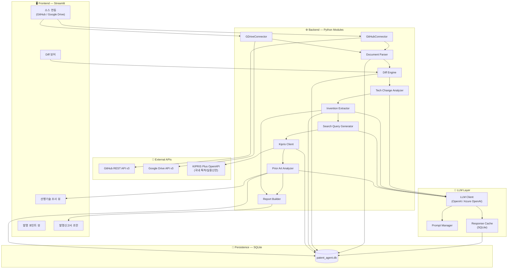
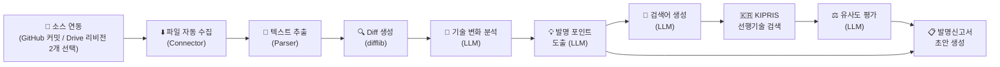
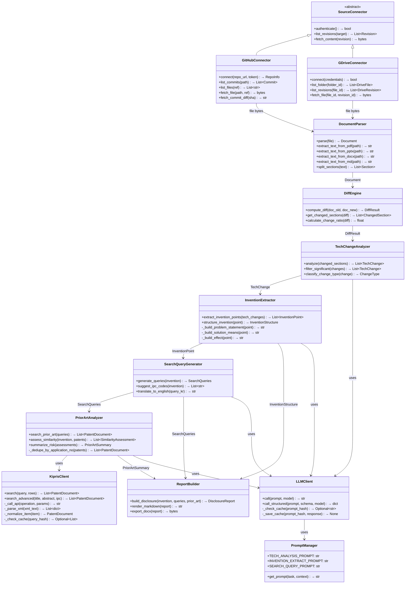
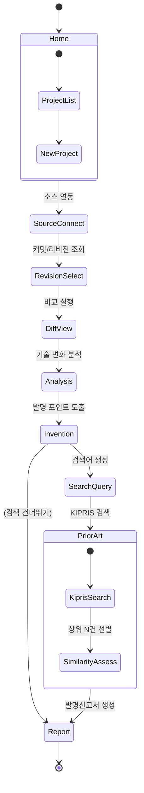
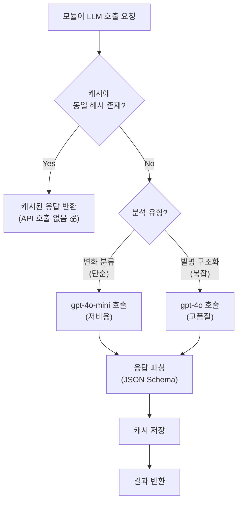
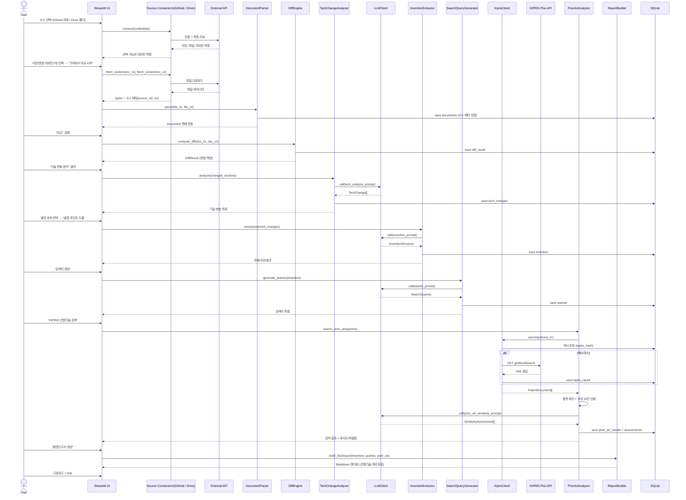

# Patent Discovery Agent — MVP 설계 문서

해커톤 예선용 MVP. 연구 산출물(GitHub Commit, PT, Readme, 연구보고서 등)을 분석하여 잠재 발명(특허 후보)을 자동 추천하는 AI Agent.

---

## 1. MVP 최소 범위 정의

### 포함 범위 (In-Scope)

| # | 기능 | 설명 |
|---|------|------|
| F0 | **문서 소스 연동** | GitHub 커밋/파일, Google Drive 문서를 자동으로 가져옴 (파일 수동 업로드 없음) |
| F1 | 문서 파싱 | `.md`, `.txt`, `.pdf`, `.pptx`, `.docx` 텍스트 추출 |
| F2 | 문서 비교 (Diff) | 이전 버전 vs 변경 버전 텍스트 diff 생성 |
| F3 | 기술 변화 추출 | Diff 결과에서 기술적으로 유의미한 변화를 AI로 요약 |
| F4 | 발명 포인트 도출 | 추출된 변화를 기반으로 발명의 **과제 / 수단 / 효과** 구조화 |
| F5 | 특허 검색어 생성 | 발명 포인트 기반 한/영 검색어(IPC 코드 포함) 자동 생성 |
| F6 | **선행기술 검색 (KIPRIS)** | 생성된 검색어로 KIPRIS Plus OpenAPI를 조회하여 유사 공개/등록 특허 목록 확보 |
| F7 | **선행기술 유사도 평가** | 검색된 특허의 초록·청구항과 발명 포인트를 LLM으로 비교 → 유사도 점수 + 차별점 도출 |
| F8 | 발명신고서 초안 | 구조화된 발명 정보 + 선행기술 조사 결과를 발명신고서 양식으로 렌더링 & 다운로드 |

### F0 — 문서 소스 연동 상세

| 소스 | 연동 방식 | 비용 | 가져오는 데이터 |
|------|-----------|------|----------------|
| **GitHub** | REST API v3 (Personal Access Token) | 무료 (5,000 req/hr) | 커밋 diff, README, 파일 내용, PR description |
| **Google Drive** | Google Drive API v3 (OAuth2 / Service Account) | 무료 (일일 Quota 충분) | `.pptx`, `.pdf`, `.docx`, `.md` 파일 다운로드 + 리비전 이력 |

> [!IMPORTANT]
> MVP의 문서 입력 경로는 **GitHub 연동**과 **Google Drive 연동 두 가지뿐**입니다. Streamlit `file_uploader`를 통한 수동 파일 업로드는 구현하지 않습니다. 연동 실패 시에는 에러 안내 후 소스 재선택으로 유도합니다.

#### GitHub 연동 흐름
1. 사용자가 **Repository URL** 또는 **owner/repo** 입력
2. Personal Access Token (PAT) 입력 (`.env`에 사전 설정 가능)
3. **커밋 목록** 조회 → 사용자가 비교할 커밋 2개 선택
4. 또는 **파일 목록** 조회 → 특정 파일의 두 버전(SHA) 선택
5. Contents API(`ref=<sha>`)로 파일 내용 자동 다운로드 → Parser로 전달

#### Google Drive 연동 흐름
1. OAuth2 인증 또는 Service Account 키 설정
2. **폴더 브라우징** → 파일 목록 표시
3. 사용자가 **이전 버전 / 변경 버전** 선택
   - 서로 다른 두 파일을 선택하거나
   - 동일 파일의 **리비전 2개**(Drive Revisions API)를 선택
4. API로 파일 자동 다운로드(`files.get` / `revisions.get`) → Parser로 전달

### F6 — 선행기술 검색 (KIPRIS) 상세

| 항목 | 내용 |
|------|------|
| **서비스** | KIPRIS Plus OpenAPI (`plus.kipris.or.kr`) — 특허청 특허정보원 제공 |
| **대상 DB** | 국내 특허 / 실용신안 (공개 + 등록) |
| **인증** | 회원가입 후 발급받는 **Service Key** (`.env`에 보관) |
| **비용** | 무료 — 단, 서비스별 **일일 호출 한도**가 있으므로 결과를 SQLite에 캐싱 |
| **엔드포인트** | `https://plus.kipris.or.kr/kipo-api/kipi/patUtiModInfoSearchSevice/{operation}` (실측 확인) |
| **인증 파라미터** | `ServiceKey` (※ `accessKey`는 인식되지 않음) |
| **페이징** | `numOfRows` / `pageNo` (※ `docsStart`/`docsCount`는 무시됨) |
| **호출 방식** | REST `GET`, 응답은 **XML** → `xmltodict`로 파싱 후 내부 JSON 모델로 정규화 |
| **사용 오퍼레이션** | `getWordSearch` (자유 키워드 검색), `getAdvancedSearch` (발명의명칭·초록·IPC 등 필드 지정 검색) |
| **가져오는 데이터** | 출원번호, 발명의 명칭, 출원인, 출원일/공개일, 등록상태, 초록(`astrtCont`), IPC 코드, KIPRIS 상세 링크 |

> [!NOTE]
> 서비스 경로는 `patUtiModInfoSearchSevice`입니다 — `patUtili…`로 쓰면 `31 DEADLINE_HAS_EXPIRED_ERROR`가 반환되어 키 만료로 오인하기 쉽습니다.
> 응답 필드 매핑은 `_normalize_item()` 한 곳에만 두어, 명세가 달라지면 그 함수만 수정하면 됩니다.

#### KIPRIS 검색 흐름
1. F5에서 생성된 검색어(`primary_kr`, `secondary_kr`, `boolean_query`, IPC 코드) 확보
2. `primary_kr`로 1차 검색 → 결과가 부족하면(`< 5건`) `secondary_kr`로 확장 검색
3. 응답 XML 파싱 → 출원번호 기준 중복 제거 → 상위 N건(기본 10건) 선별
4. 각 특허의 초록을 발명 포인트와 함께 LLM에 전달 → 유사도 점수 + 차별점 생성 (F7)
5. 결과를 발명신고서 "선행기술 조사" 섹션에 자동 삽입 (F8)

> [!IMPORTANT]
> **검색 대상은 국내(KIPRIS)로 한정**합니다. USPTO / Google Patents / EPO 등 해외 DB 연동은 MVP 범위에서 제외합니다. 영문 검색어(`primary_en`)는 신고서 참고 정보로만 제공하며 실제 API 조회에는 사용하지 않습니다.

### 제외 범위 (Out-of-Scope for MVP)

| 기능 | 제외 사유 |
|------|-----------|
| 수동 파일 업로드 (`file_uploader`) | 소스 연동(GitHub/Drive)으로 대체 — 입력 경로 이원화 방지 |
| 해외 특허 DB 검색 (USPTO / Google Patents / EPO) | 국내 KIPRIS 검색으로 범위 한정 — 영문 검색어는 참고용으로만 제공 |
| 특허 전문(명세서 원문) 다운로드 | 서지정보 + 초록만으로 유사도 판단에 충분, 추가 API 호출 비용 발생 |
| 사용자 인증/멀티 테넌시 | 해커톤 데모에 불필요 |
| 발명 이력 버전 관리 | SQLite 단일 스냅샷으로 충분 |
| 다국어 번역 | 한국어 우선, 영문 검색어만 병기 |
| GitHub Webhook (실시간 감지) | MVP에서는 수동 조회로 충분 |

---

## 2. 시스템 아키텍처

### 2.1 High-Level Architecture



### 2.2 데이터 흐름 (Pipeline)



### 2.3 비용 최소화 전략

> [!IMPORTANT]
> 토큰 비용을 최소화하기 위해 다음 전략을 적용합니다.

| 전략 | 구현 방법 |
|------|-----------|
| **응답 캐싱** | 동일 입력(해시)에 대한 LLM 응답을 SQLite에 캐싱. 재분석 시 API 호출 없음 |
| **단계별 토큰 절약** | Diff 단계는 `difflib`(로컬)로 처리 → LLM에는 diff 결과만 전달 |
| **Prompt 최적화** | 구조화된 JSON 출력 강제 → 불필요한 서술 제거 |
| **Chunking** | 긴 문서는 섹션 단위로 분할 → 변화가 있는 섹션만 LLM에 전달 |
| **모델 선택** | 분석/추출: `gpt-4o-mini` (저비용) / 발명 구조화: `gpt-4o` (고품질) |
| **Batch 처리** | 여러 변화 포인트를 하나의 프롬프트로 일괄 처리 |
| **KIPRIS 결과 캐싱** | 동일 검색어의 API 응답을 SQLite에 저장 → 일일 호출 한도 절약 |
| **유사도 평가 입력 축소** | 특허 전문이 아닌 **초록(`astrtCont`)만** LLM에 전달, 상위 10건으로 제한 |

---

## 3. 모듈별 책임 정의

### 3.1 모듈 구조



### 3.2 모듈별 상세 책임

| 모듈 | 책임 | LLM 사용 | 입력 | 출력 |
|------|------|----------|------|------|
| `GitHubConnector` | 레포 인증, 커밋/파일 목록 조회, 특정 SHA 파일 다운로드 | ❌ | repo_url + PAT + ref | 파일 바이너리 + 메타 |
| `GDriveConnector` | OAuth/서비스 계정 인증, 폴더·리비전 조회, 파일 다운로드 | ❌ | folder_id / file_id + revision_id | 파일 바이너리 + 메타 |
| `DocumentParser` | 파일 포맷별 텍스트 추출, 섹션 분리 | ❌ | 파일 바이너리 | `Document` 객체 |
| `DiffEngine` | 텍스트 diff 생성, 변경 섹션 필터링 | ❌ | `Document` × 2 | `DiffResult` |
| `TechChangeAnalyzer` | 기술적 유의미성 판단, 변화 분류 | ✅ `gpt-4o-mini` | `ChangedSection[]` | `TechChange[]` |
| `InventionExtractor` | 발명 포인트 도출, 과제/수단/효과 구조화 | ✅ `gpt-4o` | `TechChange[]` | `InventionStructure` |
| `SearchQueryGenerator` | 특허 검색 키워드/IPC 코드 생성 | ✅ `gpt-4o-mini` | `InventionPoint` | `SearchQueries` |
| `KiprisClient` | KIPRIS Plus API 호출, XML 파싱, 응답 캐싱 | ❌ | 검색어 + Service Key | `PatentDocument[]` |
| `PriorArtAnalyzer` | 검색 결과 중복 제거·선별, 발명 대비 유사도/차별점 평가 | ✅ `gpt-4o-mini` | `SearchQueries` + `InventionStructure` | `SimilarityAssessment[]`, `PriorArtSummary` |
| `ReportBuilder` | 발명신고서 마크다운/DOCX 렌더링 | ❌ | `InventionStructure` + `SearchQueries` + `PriorArtSummary` | 파일 |
| `LLMClient` | API 호출, 캐싱, 에러 핸들링 | — | Prompt | Response |
| `PromptManager` | 프롬프트 템플릿 관리 | — | Task Type + Context | Prompt |

---

## 4. 데이터 모델

### 4.1 ER Diagram

```mermaid
erDiagram
    PROJECT ||--o{ SOURCE_CONNECTION : "connected to"
    SOURCE_CONNECTION ||--o{ DOCUMENT : "fetched from"
    PROJECT ||--o{ DOCUMENT : contains
    DOCUMENT ||--o{ DIFF_RESULT : "compared as"
    DIFF_RESULT ||--o{ TECH_CHANGE : produces
    TECH_CHANGE }o--|| INVENTION_POINT : "contributes to"
    INVENTION_POINT ||--|| INVENTION_STRUCTURE : "structured as"
    INVENTION_POINT ||--o{ SEARCH_QUERY : generates
    SEARCH_QUERY ||--o{ PRIOR_ART_RESULT : "searched via KIPRIS"
    PRIOR_ART_RESULT ||--o| SIMILARITY_ASSESSMENT : "assessed as"
    INVENTION_POINT ||--|| DISCLOSURE_REPORT : "rendered in"
    LLM_CACHE ||--|| LLM_CACHE : standalone
    KIPRIS_CACHE ||--|| KIPRIS_CACHE : standalone

    PROJECT {
        string id PK
        string name
        string description
        datetime created_at
    }

    SOURCE_CONNECTION {
        string id PK
        string project_id FK
        string source_type
        string repo_url
        string folder_id
        string credential_ref
        datetime connected_at
    }

    DOCUMENT {
        string id PK
        string project_id FK
        string source_connection_id FK
        string source_type
        string source_path
        string source_ref
        string source_url
        string filename
        string file_type
        text content
        int version
        datetime fetched_at
    }

    DIFF_RESULT {
        string id PK
        string doc_old_id FK
        string doc_new_id FK
        text diff_text
        float change_ratio
        datetime created_at
    }

    TECH_CHANGE {
        string id PK
        string diff_id FK
        string change_type
        text description
        text original_text
        text changed_text
        float significance_score
    }

    INVENTION_POINT {
        string id PK
        string tech_change_id FK
        text title
        text summary
        datetime created_at
    }

    INVENTION_STRUCTURE {
        string id PK
        string invention_point_id FK
        text problem
        text solution_means
        text effect
        text technical_field
        text background_art
    }

    SEARCH_QUERY {
        string id PK
        string invention_point_id FK
        text query_kr
        text query_en
        text ipc_codes
    }

    PRIOR_ART_RESULT {
        string id PK
        string search_query_id FK
        string application_number
        string invention_title
        string applicant_name
        string application_date
        string open_date
        string register_status
        text abstract
        string ipc_codes
        string kipris_url
        int rank
        datetime searched_at
    }

    SIMILARITY_ASSESSMENT {
        string id PK
        string prior_art_result_id FK
        string invention_point_id FK
        float similarity_score
        string risk_level
        text overlapping_points
        text differentiating_points
        text reasoning
    }

    DISCLOSURE_REPORT {
        string id PK
        string invention_point_id FK
        text report_markdown
        blob report_docx
        datetime generated_at
    }

    LLM_CACHE {
        string prompt_hash PK
        text prompt
        text response
        string model
        datetime cached_at
    }

    KIPRIS_CACHE {
        string query_hash PK
        text query
        text response_json
        int result_count
        datetime cached_at
    }
```



#### 소스 관련 필드 규약

| 필드 | GitHub | Google Drive |
|------|--------|--------------|
| `source_type` | `"github"` | `"gdrive"` |
| `source_path` | 레포 내 파일 경로 (`docs/report.md`) | Drive 파일 ID |
| `source_ref` | 커밋 SHA | 리비전 ID (`revisionId`) |
| `source_url` | `https://github.com/{owner}/{repo}/blob/{sha}/{path}` | `webViewLink` |

> [!NOTE]
> `source_type + source_path + source_ref` 조합이 문서의 고유 식별자 역할을 합니다. 동일 조합이 이미 있으면 재수집하지 않고 기존 레코드를 재사용해 API 호출과 LLM 비용을 아낍니다.

### 4.2 SQLite 테이블 요약

| 테이블 | 레코드 수 (예상) | 용도 |
|--------|------------------|------|
| `project` | 1~5 | 프로젝트 메타 |
| `source_connection` | 1~5 | GitHub 레포 / Drive 폴더 연결 정보 |
| `document` | 2~20 | 소스에서 수집된 문서 |
| `diff_result` | 1~10 | 문서 비교 결과 |
| `tech_change` | 5~50 | 추출된 기술 변화 |
| `invention_point` | 1~10 | 발명 후보 |
| `invention_structure` | 1~10 | 과제/수단/효과 |
| `search_query` | 1~10 | 검색어 |
| `prior_art_result` | 10~100 | KIPRIS 검색 결과 (발명당 상위 10건) |
| `similarity_assessment` | 10~100 | 선행기술별 유사도/차별점 평가 |
| `disclosure_report` | 1~10 | 발명신고서 초안 |
| `llm_cache` | 10~100 | LLM 응답 캐시 |
| `kipris_cache` | 5~50 | KIPRIS API 응답 캐시 (검색어 해시 기준) |

---

## 5. 화면 구성

### 5.1 화면 흐름



### 5.2 화면별 상세

#### Page 1: 🏠 프로젝트 홈 (`pages/home.py`)
- 프로젝트 목록 (카드 형태)
- 새 프로젝트 생성 버튼
- 최근 분석 히스토리

#### Page 2: 🔗 소스 연동 (`pages/source.py`)
- `st.tabs(["GitHub", "Google Drive"])` 로 소스 선택
- **GitHub 탭**
  - Repository URL / `owner/repo` 입력, PAT 입력 (`.env` 값 자동 채움)
  - "연결" 버튼 → 레포 검증 후 파일 트리 표시
  - 분석할 파일 선택 → 해당 파일의 커밋 목록(`st.dataframe`) 표시
  - 이전 커밋 / 변경 커밋 2개 선택 (`st.selectbox` × 2)
- **Google Drive 탭**
  - OAuth 인증 버튼 또는 서비스 계정 키 상태 표시
  - 폴더 브라우징 → 파일 목록 표시
  - 이전 버전 / 변경 버전 선택 (서로 다른 파일 또는 동일 파일의 리비전 2개)
- 선택 결과 요약 카드 (파일명, ref, 수정일, 작성자)
- 지원 포맷 안내 (`.md`, `.txt`, `.pdf`, `.pptx`, `.docx`)
- "가져와서 비교 시작" 버튼 → Connector가 파일 수집 → Parser 실행

#### Page 3: 🔍 Diff 뷰어 (`pages/diff_view.py`)
- Side-by-side diff 또는 unified diff 뷰
- 변경 비율(%) 표시
- 변경된 섹션 하이라이트
- "기술 변화 분석" 버튼

#### Page 4: 🧠 기술 변화 분석 (`pages/analysis.py`)
- 추출된 기술 변화 목록 (테이블)
- 각 변화별: 유형, 설명, 유의미성 점수
- 체크박스로 발명 후보 선택
- "발명 포인트 도출" 버튼

#### Page 5: 💡 발명 포인트 (`pages/invention.py`)
- **발명 제목** + **요약**
- 구조화된 카드:
  - 🎯 **기술적 과제** (Problem)
  - 🔧 **해결 수단** (Solution Means)
  - ✨ **기대 효과** (Effect)
- 검색어 생성 결과 (한/영, IPC 코드)
- "KIPRIS 선행기술 검색" 버튼

#### Page 6: 🇰🇷 선행기술 조사 (`pages/prior_art.py`)
- 상단: 실제 사용된 검색어 표시 + 수정 가능 (`st.text_input`) → "재검색" 버튼
- 검색 결과 테이블 (`st.dataframe`)
  - 출원번호 / 발명의 명칭 / 출원인 / 출원일 / 등록상태 / 유사도 점수
  - 출원번호 클릭 시 KIPRIS 상세 페이지 새 탭 열기
- 각 행 확장(`st.expander`) 시:
  - 📄 초록 전문
  - 🔴 **중복 우려 포인트** (본 발명과 겹치는 구성)
  - 🟢 **차별점** (본 발명만의 구성)
  - 유사도 근거 (LLM reasoning)
- 상단 요약 배너: 최고 유사도 + 위험도 (`HIGH` 🔴 / `MEDIUM` 🟡 / `LOW` 🟢)
- 결과 0건일 경우: "유사 선행기술이 발견되지 않았습니다 — 신규성 가능성 높음" 안내 + 검색어 완화 제안
- "발명신고서 생성" 버튼 (검색 건너뛰기 링크 제공)

#### Page 7: 📋 발명신고서 초안 (`pages/report.py`)
- 발명신고서 양식 미리보기 (마크다운 렌더링)
- **선행기술 조사 결과 섹션 자동 포함** (검색한 DB, 검색어, 상위 특허 목록, 차별점)
- 각 섹션 인라인 편집 가능 (`st.text_area`)
- 다운로드 버튼 (`.md` / `.docx`)

### 5.3 Streamlit 레이아웃 와이어프레임

```
┌─────────────────────────────────────────────────┐
│  🔬 Patent Discovery Agent        [프로젝트 ▼]  │
├──────────┬──────────────────────────────────────┤
│          │  [ GitHub ] [ Google Drive ]         │
│ 🔗 연동   │  ┌────────────────────────────────┐ │
│ 🔍 비교   │  │ Repo: owner/repo      [연결]   │ │
│ 🧠 분석   │  │ 파일: docs/report.md      ▼    │ │
│ 💡 발명   │  └────────────────────────────────┘ │
│ 🇰🇷 선행   │   ┌──────────┐  ┌──────────┐       │
│ 📋 신고서 │   │          │  │          │       │
│          │   │ 이전 커밋 │  │ 변경 커밋 │       │
│          │   │ a1b2c3d ▼│  │ e4f5g6h ▼│       │
│          │   └──────────┘  └──────────┘       │
│          │   [ 가져와서 비교 시작 ]             │
├──────────┴──────────────────────────────────────┤
│  Status: GitHub 연결됨 (rate limit 4,892/5,000) │
└─────────────────────────────────────────────────┘
```

---

## 6. 폴더 구조

```
patent-discovery-agent/
├── app.py                          # Streamlit 메인 엔트리포인트
├── requirements.txt                # Python 의존성
├── .env.example                    # 환경변수 템플릿
├── README.md                       # 프로젝트 설명
│
├── config/
│   └── settings.py                 # 앱 설정 (모델명, DB경로 등)
│
├── pages/                          # Streamlit 멀티페이지
│   ├── 1_🔗_Source.py
│   ├── 2_🔍_Diff.py
│   ├── 3_🧠_Analysis.py
│   ├── 4_💡_Invention.py
│   ├── 5_🇰🇷_PriorArt.py
│   └── 6_📋_Report.py
│
├── sources/                        # 외부 문서 소스 커넥터
│   ├── __init__.py
│   ├── base.py                     # SourceConnector (추상 클래스)
│   ├── github_connector.py         # GitHubConnector
│   └── gdrive_connector.py         # GDriveConnector
│
├── patent/                         # 특허 DB 연동
│   ├── __init__.py
│   ├── kipris_client.py            # KiprisClient (KIPRIS Plus OpenAPI)
│   └── schemas.py                  # PatentDocument, SimilarityAssessment
│
├── core/                           # 비즈니스 로직
│   ├── __init__.py
│   ├── parser.py                   # DocumentParser
│   ├── differ.py                   # DiffEngine
│   ├── analyzer.py                 # TechChangeAnalyzer
│   ├── inventor.py                 # InventionExtractor
│   ├── searcher.py                 # SearchQueryGenerator
│   ├── prior_art.py                # PriorArtAnalyzer
│   └── reporter.py                 # ReportBuilder
│
├── llm/                            # LLM 관련
│   ├── __init__.py
│   ├── client.py                   # LLMClient (캐싱 포함)
│   └── prompts.py                  # PromptManager (프롬프트 템플릿)
│
├── db/                             # 데이터베이스
│   ├── __init__.py
│   ├── models.py                   # SQLAlchemy / dataclass 모델
│   ├── repository.py               # CRUD 함수
│   └── init_db.py                  # DB 초기화 스크립트
│
├── templates/                      # 발명신고서 양식 템플릿
│   └── disclosure_template.md
│
├── utils/                          # 유틸리티
│   ├── __init__.py
│   ├── file_utils.py               # 파일 I/O 헬퍼
│   └── hash_utils.py               # 해시 생성 (캐싱용)
│
├── tests/                          # 테스트
│   ├── test_sources.py             # 커넥터 테스트 (API 모킹)
│   ├── test_kipris.py              # KIPRIS 클라이언트 테스트 (XML 모킹)
│   ├── test_parser.py
│   ├── test_differ.py
│   ├── test_analyzer.py
│   └── fixtures/                   # 테스트용 샘플 문서 & API 응답
│       ├── sample_v1.md
│       ├── sample_v2.md
│       ├── github_commits.json
│       ├── gdrive_revisions.json
│       └── kipris_search.xml
│
└── data/                           # 런타임 데이터 (gitignore)
    ├── patent_agent.db             # SQLite DB 파일
    ├── fetched/                    # 소스에서 가져온 파일 캐시
    └── credentials/                # Drive OAuth 토큰 / 서비스 계정 키
```

---

## 7. 개발 우선순위

### Phase 1: 기반 인프라 (Day 1 오전)

| 순서 | 태스크 | 시간 |
|------|--------|------|
| 1-0 | **KIPRIS Plus 계정 신청 & Service Key 발급** (승인 대기 있으므로 최우선) | 20분 + 대기 |
| 1-1 | 프로젝트 초기화 (폴더, requirements, .env) | 30분 |
| 1-2 | SQLite DB 스키마 & 초기화 | 30분 |
| 1-3 | LLMClient + 캐싱 레이어 | 45분 |
| 1-4 | PromptManager 템플릿 작성 | 30분 |
| 1-5 | GitHubConnector (커밋/파일 조회 + 다운로드) | 1시간 |
| 1-6 | GDriveConnector (인증 + 폴더/리비전 + 다운로드) | 1시간 |

### Phase 2: 핵심 파이프라인 (Day 1 오후)

| 순서 | 태스크 | 시간 |
|------|--------|------|
| 2-1 | DocumentParser (md, txt, pdf, pptx, docx) | 1시간 |
| 2-2 | DiffEngine (difflib 기반) | 45분 |
| 2-3 | TechChangeAnalyzer (LLM 분석) | 1시간 |
| 2-4 | InventionExtractor (과제/수단/효과) | 1시간 |

### Phase 3: 출력 생성 (Day 2 오전)

| 순서 | 태스크 | 시간 |
|------|--------|------|
| 3-1 | SearchQueryGenerator | 45분 |
| 3-2 | KiprisClient (API 호출 + XML 파싱 + 캐싱) | 1시간 |
| 3-3 | PriorArtAnalyzer (선별 + LLM 유사도 평가) | 1시간 |
| 3-4 | ReportBuilder (발명신고서 초안) | 1시간 |
| 3-5 | 발명신고서 템플릿 작성 (선행기술 섹션 포함) | 30분 |

### Phase 4: UI 통합 (Day 2 오후)

| 순서 | 태스크 | 시간 |
|------|--------|------|
| 4-1 | Streamlit 메인 + 사이드바 | 30분 |
| 4-2 | 소스 연동 페이지 (GitHub / Drive 탭) | 1시간 |
| 4-3 | Diff 뷰어 페이지 | 45분 |
| 4-4 | 분석 결과 페이지 | 45분 |
| 4-5 | 발명 포인트 페이지 | 45분 |
| 4-6 | 선행기술 조사 페이지 (KIPRIS 결과 + 유사도) | 45분 |
| 4-7 | 발명신고서 페이지 + 다운로드 | 45분 |

### Phase 5: 마무리 (Day 3)

| 순서 | 태스크 | 시간 |
|------|--------|------|
| 5-1 | End-to-end 테스트 | 1시간 |
| 5-2 | 데모 시나리오 준비 (샘플 데이터) | 30분 |
| 5-3 | README 작성 | 30분 |

---

## 8. 해커톤 예선 기능 구분

### ✅ 반드시 구현 (Must-Have)

| 기능 | 심사 포인트 | 이유 |
|------|-------------|------|
| GitHub 연동 (커밋 선택 → 자동 수집) | 실용성 | 연구 산출물이 실제로 쌓이는 곳, 수동 업로드 없는 워크플로 |
| Google Drive 연동 (파일/리비전 선택) | 실용성 | PT·보고서 등 비-코드 산출물 커버 |
| 문서 파싱 | 입력 처리 | 파이프라인 시작점, 없으면 데모 불가 |
| Diff 생성 & 시각화 | 기술 차별성 | "이전 vs 변경" 비교가 핵심 가치 |
| 기술 변화 분석 (AI) | AI 활용도 | LLM을 활용한 핵심 분석 기능 |
| 발명 포인트 도출 | 핵심 가치 | 과제/수단/효과 구조화가 최종 결과물 |
| 특허 검색어 자동 생성 (IPC 포함) | 실용성 | KIPRIS 검색의 입력, 파이프라인 연결고리 |
| KIPRIS 선행기술 검색 | 차별성 | "발명 후보 → 실제 특허 DB 대조"까지 닿는 유일한 구간, 데모 임팩트 큼 |
| 발명신고서 초안 생성 | 완결성 | 심사위원에게 보여줄 최종 산출물 |

### ⭐ 구현하면 가산점 (Nice-to-Have)

| 기능 | 심사 포인트 |
|------|-------------|
| 선행기술 LLM 유사도 평가 (중복/차별점) | 분석 깊이 — 단순 검색을 넘어선 판단 지원 |
| KIPRIS 응답 캐싱 | 기술 완성도 + API 한도 대응 |
| 검색어 수동 수정 후 재검색 | 실사용성 |
| 발명신고서 DOCX 다운로드 | 완성도 |
| LLM 응답 캐싱 | 기술 완성도 |
| 변화 유의미성 점수 (Significance Score) | 분석 깊이 |

> [!WARNING]
> KIPRIS Service Key 발급이 데모 전까지 완료되지 않을 위험에 대비해, `KIPRIS_SERVICE_KEY`가 없으면 `tests/fixtures/kipris_search.xml`을 응답으로 사용하는 **오프라인 모드**(`KIPRIS_OFFLINE=true`)를 함께 구현합니다. 시연 중단을 막는 안전장치이며, 화면에 "샘플 데이터" 배지를 표시해 실제 조회와 구분합니다.

### ❌ 제외해도 무방 (Won't-Do)

| 기능 | 제외 사유 |
|------|-----------|
| 수동 파일 업로드 | GitHub / Drive 연동으로 대체 |
| GitHub Webhook 실시간 커밋 추적 | 사용자가 커밋을 선택하는 수동 조회로 충분 |
| Drive Push Notification (변경 구독) | 폴링·수동 조회로 충분, 콜백 URL 필요 |
| 해외 특허 DB (USPTO / Google Patents / EPO) | 국내 KIPRIS로 범위 한정 — 키 발급·쿼터 관리 부담 |
| 특허 명세서 전문 조회 / 도면 다운로드 | 서지정보 + 초록으로 충분, 별도 API·비용 발생 |
| 사용자 로그인/인증 | 데모에 불필요 |
| 다국어 지원 | 한국어 중심으로 충분 |
| CI/CD, Docker | 로컬 실행 데모로 충분 |

---

## 9. Mermaid Architecture Diagrams

### 9.1 전체 시스템 아키텍처 (위 섹션 2.1 참조)

### 9.2 LLM 호출 최적화 흐름



### 9.3 문서 처리 파이프라인 시퀀스



---

## 10. Task Breakdown (Claude Code 개발용)

> [!TIP]
> 각 태스크는 독립적으로 실행 가능하며, 의존성 순서대로 나열되어 있습니다. Claude Code에 태스크 번호와 함께 지시하면 됩니다.

---

### Task 0: 프로젝트 초기화

```
[Task 0] 프로젝트 초기화

1. patent-discovery-agent/ 폴더 생성
2. 위 섹션 6의 폴더 구조 전체 생성 (빈 __init__.py 포함)
3. requirements.txt 작성:
   - streamlit>=1.28
   - openai>=1.0
   - python-pptx
   - PyPDF2
   - python-docx
   - python-dotenv
   - requests                        # GitHub REST API / KIPRIS API 호출
   - google-api-python-client        # Google Drive API v3
   - google-auth
   - google-auth-oauthlib
   - xmltodict                       # KIPRIS XML 응답 파싱
4. .env.example 작성:
   - OPENAI_API_KEY=
   - OPENAI_MODEL_PRIMARY=gpt-4o
   - OPENAI_MODEL_SECONDARY=gpt-4o-mini
   - GITHUB_TOKEN=                   # Personal Access Token (repo 읽기 권한)
   - GITHUB_DEFAULT_REPO=            # 데모용 owner/repo (선택)
   - GDRIVE_CREDENTIALS_PATH=data/credentials/service_account.json
   - GDRIVE_TOKEN_PATH=data/credentials/token.json
   - GDRIVE_DEFAULT_FOLDER_ID=       # 데모용 폴더 ID (선택)
   - KIPRIS_SERVICE_KEY=             # KIPRIS Plus 발급 Service Key
   - KIPRIS_MAX_RESULTS=10           # 유사도 평가 대상 상위 N건
   - KIPRIS_OFFLINE=false            # true면 fixture XML 사용 (데모 안전장치)
5. config/settings.py 작성:
   - .env 로드
   - DB_PATH, FETCH_CACHE_DIR, CREDENTIALS_DIR, MODEL 상수 정의
   - GITHUB_API_BASE = "https://api.github.com"
   - GDRIVE_SCOPES = ["https://www.googleapis.com/auth/drive.readonly"]
   - KIPRIS_API_BASE = "http://plus.kipris.or.kr/openapi/rest"
   - KIPRIS_SERVICE = "patUtiliModInfoSearchSevice"   # 특허·실용신안 검색 서비스
     * 주의: 서비스명/오퍼레이션명은 KIPRIS Plus 명세서로 최종 확인할 것
6. .gitignore 작성:
   - data/, .env, data/credentials/ (토큰·키 커밋 방지)
```

---

### Task 1: 데이터베이스 계층

```
[Task 1] SQLite 데이터베이스 구현

1. db/models.py — 섹션 4.1 ER 다이어그램 기반 dataclass 정의
   - Project, SourceConnection, Document, DiffResult, TechChange,
     InventionPoint, InventionStructure, SearchQuery,
     PriorArtResult, SimilarityAssessment,
     DisclosureReport, LLMCache, KiprisCache
   - Document에는 소스 메타 필드 포함:
     source_connection_id, source_type, source_path, source_ref, source_url, fetched_at
   - 각 모델에 id는 uuid4 기본값, created_at은 datetime.now 기본값

2. db/init_db.py — CREATE TABLE IF NOT EXISTS 스크립트
   - 섹션 4.1의 모든 테이블 생성
   - 외래 키 제약조건 포함

3. db/repository.py — CRUD 함수
   - save_source_connection(conn) → str (id)
   - get_source_connections(project_id) → List[SourceConnection]
   - save_document(doc) → str (id)
   - get_document_by_source(source_type, source_path, source_ref) → Optional[Document]
     * 동일 리비전 재수집 방지용
   - get_documents_by_project(project_id) → List[Document]
   - save_diff_result(diff) → str
   - save_tech_change(change) → str
   - save_invention_point(point) → str
   - save_invention_structure(structure) → str
   - save_search_query(query) → str
   - save_prior_art_results(query_id, results) → List[str]
   - get_prior_art_results(query_id) → List[PriorArtResult]
   - save_similarity_assessment(assessment) → str
   - save_disclosure_report(report) → str
   - get_cache(prompt_hash) → Optional[str]
   - set_cache(prompt_hash, prompt, response, model) → None
   - get_kipris_cache(query_hash) → Optional[dict]
   - set_kipris_cache(query_hash, query, response_json, result_count) → None
   - 각 함수는 sqlite3 모듈 직접 사용 (ORM 불필요)
```

---

### Task 2: LLM 클라이언트 & 프롬프트 매니저

```
[Task 2] LLM 클라이언트 구현

1. llm/client.py — LLMClient 클래스
   - __init__: OpenAI 클라이언트 초기화
   - call(prompt: str, model: str = None) → str:
     * prompt SHA256 해시 계산
     * 캐시 확인 (db/repository.get_cache)
     * 캐시 히트 시 캐시 반환
     * 캐시 미스 시 OpenAI API 호출
     * 응답 캐시 저장
     * 응답 반환
   - call_structured(prompt: str, response_schema: dict, model: str = None) → dict:
     * response_format={"type": "json_object"} 사용
     * JSON 파싱 후 반환
   - 에러 핸들링: API 에러 시 3회 재시도 (exponential backoff)

2. llm/prompts.py — PromptManager
   - TECH_ANALYSIS_PROMPT: 변경된 텍스트를 받아 기술적 변화를 JSON으로 분류
     * 입력: diff 텍스트
     * 출력 스키마: [{change_type, description, significance_score, original, changed}]
   - INVENTION_EXTRACT_PROMPT: 기술 변화에서 발명 포인트를 구조화
     * 입력: 기술 변화 목록
     * 출력 스키마: {title, summary, problem, solution_means, effect, technical_field}
   - SEARCH_QUERY_PROMPT: 발명 포인트에서 검색어 생성
     * 입력: 발명 구조
     * 출력 스키마: {query_kr, query_en, ipc_codes[]}
   - PRIOR_ART_SIMILARITY_PROMPT: KIPRIS 검색 결과와 발명 포인트 비교
     * 입력: 발명 구조 + 특허 초록 목록 (출원번호, 명칭, 초록)
     * 출력 스키마: [{application_number, similarity_score, risk_level,
                     overlapping_points, differentiating_points, reasoning}]
     * 여러 특허를 1회 호출로 일괄 평가 (토큰 절약)
   - 모든 프롬프트는 한국어로 작성
   - 모든 프롬프트에 "반드시 JSON으로만 응답하라" 지시 포함
```

---

### Task 3: 소스 커넥터 (GitHub / Google Drive)

```
[Task 3] SourceConnector 구현

1. sources/base.py — SourceConnector 추상 클래스:
   - authenticate() → bool
   - list_revisions(target: str) → List[Revision]
   - fetch_content(revision: Revision) → bytes
   - Revision = dataclass(ref, label, path, author, modified_at, url)
   - 지원 확장자 필터 상수: SUPPORTED_EXT = {".md", ".txt", ".pdf", ".pptx", ".docx"}

2. sources/github_connector.py — GitHubConnector:
   - __init__(token: str) — requests.Session에 Authorization 헤더 설정
   - connect(repo_url_or_slug) → RepoInfo:
     * "https://github.com/owner/repo" / "owner/repo" 모두 파싱
     * GET /repos/{owner}/{repo} 로 존재·권한 검증
   - list_files(ref="HEAD") → List[str]:
     * GET /repos/{owner}/{repo}/git/trees/{ref}?recursive=1
     * SUPPORTED_EXT 확장자만 필터
   - list_commits(path) → List[Revision]:
     * GET /repos/{owner}/{repo}/commits?path={path}&per_page=30
     * sha, commit.message 첫 줄, author, date → Revision
   - fetch_file(path, ref) → bytes:
     * GET /repos/{owner}/{repo}/contents/{path}?ref={ref}
     * base64 content 디코딩 (1MB 초과 시 download_url로 재요청)
   - get_rate_limit() → dict: GET /rate_limit (UI 상태바 표시용)
   - 401/403/404 → SourceError로 변환

3. sources/gdrive_connector.py — GDriveConnector:
   - __init__(credentials_path, token_path) — 서비스 계정 우선, 없으면 OAuth InstalledAppFlow
   - authenticate() → bool: drive.readonly 스코프로 build("drive", "v3")
   - list_folder(folder_id) → List[DriveFile]:
     * files().list(q="'{folder_id}' in parents and trashed=false",
                    fields="files(id,name,mimeType,modifiedTime,webViewLink)")
     * Google Docs/Slides 네이티브 문서는 export 대상으로 표시
   - list_revisions(file_id) → List[Revision]:
     * revisions().list(fileId, fields="revisions(id,modifiedTime,lastModifyingUser)")
   - fetch_file(file_id, revision_id=None) → bytes:
     * 바이너리 파일: files().get_media() 또는 revisions().get_media()
     * 네이티브 Google 문서: files().export_media(mimeType=...)
       - Docs → text/plain, Slides → application/pdf
   - 인증 실패/권한 없음 → SourceError로 변환

4. 공통:
   - 다운로드한 파일은 data/fetched/{source_type}/{ref}_{filename} 으로 캐싱
   - 동일 (source_type, path, ref) 재요청 시 캐시 파일 사용 → API 호출 없음
```

---

### Task 4: 문서 파서

```
[Task 4] DocumentParser 구현

core/parser.py:
1. parse(file_bytes, filename, source_meta) → Document:
   - 확장자 판별 후 적절한 추출 함수 호출
   - source_meta(source_type, source_path, source_ref, source_url)를 Document에 기록
   - Document 객체 생성 및 반환

2. extract_text_from_md(file_bytes) → str:
   - UTF-8 디코딩
   - 마크다운 그대로 텍스트 반환

3. extract_text_from_txt(file_bytes) → str:
   - UTF-8 디코딩

4. extract_text_from_pdf(file_bytes) → str:
   - PyPDF2.PdfReader 사용
   - 모든 페이지 텍스트 추출 및 합치기

5. extract_text_from_pptx(file_bytes) → str:
   - python-pptx 사용
   - 모든 슬라이드의 모든 shape에서 텍스트 추출
   - 슬라이드 번호 구분자 포함 ("--- Slide N ---")

5-1. extract_text_from_docx(file_bytes) → str:
   - python-docx 사용 (신고서 DOCX 내보내기와 동일 의존성)
   - 문단 + 표 셀 텍스트 추출 (설계 리뷰 문서가 표 기반인 경우가 많음)
   - Word 제목 스타일(Heading N / 제목 N)은 마크다운 헤딩(#)으로 변환 → 섹션 분리에 재사용
   - 표는 "| 셀 | 셀 |" 형태의 마크다운 행으로 직렬화
   - 파싱 실패 시 DocumentParseError(E1005)

6. split_sections(text) → List[Section]:
   - 마크다운 헤딩(#, ##, ###) 또는 빈 줄 기준으로 섹션 분리
   - Section = dataclass(index, heading, content)
```

---

### Task 5: Diff 엔진

```
[Task 5] DiffEngine 구현

core/differ.py:
1. compute_diff(doc_old: Document, doc_new: Document) → DiffResult:
   - difflib.unified_diff 사용
   - 전체 diff 텍스트 생성
   - 변경 비율 계산

2. get_changed_sections(old_sections, new_sections) → List[ChangedSection]:
   - 섹션 제목 매칭 (fuzzy matching: difflib.SequenceMatcher)
   - 매칭된 섹션 쌍 중 내용이 다른 것만 추출
   - ChangedSection = dataclass(heading, old_content, new_content, diff_text)

3. calculate_change_ratio(old_text, new_text) → float:
   - SequenceMatcher.ratio() 기반
   - 1 - ratio = 변경률 (0.0 ~ 1.0)

4. format_diff_html(diff_text) → str:
   - 추가 줄: 녹색, 삭제 줄: 빨간색
   - Streamlit에서 st.markdown(html, unsafe_allow_html=True) 용
```

---

### Task 6: 기술 변화 분석기

```
[Task 6] TechChangeAnalyzer 구현

core/analyzer.py:
1. analyze(changed_sections: List[ChangedSection], llm_client: LLMClient) → List[TechChange]:
   - 변경 섹션들을 하나의 컨텍스트로 묶기 (토큰 절약)
   - PromptManager.TECH_ANALYSIS_PROMPT에 주입
   - LLMClient.call_structured() 호출
   - 응답 JSON → TechChange 리스트 변환

2. filter_significant(changes: List[TechChange], threshold: float = 0.5) → List[TechChange]:
   - significance_score >= threshold인 변화만 필터

3. classify_change_type(change) → str:
   - LLM 응답에 포함된 change_type 반환
   - 유형: "algorithm", "architecture", "data_structure", "interface",
           "optimization", "new_feature", "bug_fix", "other"
   - "bug_fix", "other"는 유의미하지 않으므로 필터링 대상
```

---

### Task 7: 발명 추출기

```
[Task 7] InventionExtractor 구현

core/inventor.py:
1. extract_invention_points(tech_changes: List[TechChange], llm_client: LLMClient) → List[InventionPoint]:
   - 유의미한 tech_changes를 묶어서 프롬프트 구성
   - 하나의 LLM 호출로 발명 후보 리스트 도출
   - 각 후보를 InventionPoint 객체로 변환

2. structure_invention(point: InventionPoint, llm_client: LLMClient) → InventionStructure:
   - InventionPoint를 입력으로
   - INVENTION_EXTRACT_PROMPT 사용
   - JSON 응답에서 다음 필드 추출:
     * problem: 기술적 과제 (종래 기술의 문제점)
     * solution_means: 해결 수단 (구체적 기술 구성)
     * effect: 기대 효과 (정량적 표현 권장)
     * technical_field: 기술 분야
     * background_art: 배경 기술 요약
   - InventionStructure 객체로 반환
```

---

### Task 8: 검색어 생성기

```
[Task 8] SearchQueryGenerator 구현

core/searcher.py:
1. generate_queries(invention: InventionStructure, llm_client: LLMClient) → SearchQueries:
   - SEARCH_QUERY_PROMPT에 발명 구조 주입
   - LLM 호출
   - 응답 JSON에서 추출:
     * query_kr: 한국어 검색어 (키프리스용)
     * query_en: 영문 검색어 (신고서 참고용 — API 조회에는 미사용)
     * ipc_codes: 추천 IPC 분류 코드 리스트 (예: "G06N 3/08")

2. SearchQueries = dataclass:
   - query_kr: str
   - query_en: str
   - ipc_codes: List[str]

3. 주의: query_en은 발명신고서 참고용이며 KIPRIS 조회에는 사용하지 않음
   (검색 대상은 국내 특허/실용신안으로 한정)
```

---

### Task 9: KIPRIS 선행기술 검색

```
[Task 9] KiprisClient + PriorArtAnalyzer 구현

1. patent/schemas.py — dataclass 정의:
   - PatentDocument:
     application_number, invention_title, applicant_name,
     application_date, open_date, register_status,
     abstract, ipc_codes: List[str], kipris_url
   - SimilarityAssessment:
     application_number, similarity_score: float, risk_level: str,
     overlapping_points: str, differentiating_points: str, reasoning: str
   - PriorArtSummary:
     total_found, assessed_count, max_similarity, overall_risk,
     key_differentiators: List[str]

2. patent/kipris_client.py — KiprisClient:
   - __init__(service_key: str, offline: bool = False)
   - search(query: str, rows: int = 10, page: int = 1) → List[PatentDocument]:
     * GET {KIPRIS_API_BASE}/{KIPRIS_SERVICE}/getWordSearch
     * params: word=query, ServiceKey=..., numOfRows=rows, pageNo=page,
               patent=true, utility=true, sortSpec=AD, descSort=true
     * 응답 XML → xmltodict.parse() → items/item 리스트 추출
   - search_advanced(title=None, abstract=None, ipc=None) → List[PatentDocument]:
     * getAdvancedSearch 오퍼레이션 사용 (inventionTitle, astrtCont, ipcNumber)
   - _normalize_item(item: dict) → PatentDocument:
     * 필드명 매핑 (applicationNumber, inventionTitle, applicantName,
       applicationDate, openDate, registerStatus, astrtCont, ipcNumber)
     * kipris_url = "https://www.kipris.or.kr" 기반 상세 링크 조립
     * 누락 필드는 빈 문자열로 처리 (KeyError 금지)
   - 캐싱:
     * query_hash = SHA256(operation + 정렬된 params)
     * repository.get_kipris_cache() 히트 시 API 호출 없음
   - 오프라인 모드:
     * offline=True이거나 service_key가 비어 있으면
       tests/fixtures/kipris_search.xml을 응답으로 사용하고
       결과에 is_sample=True 플래그 표시
   - 에러: resultCode != "00"이거나 HTTP 오류 시 KiprisError 발생
   - 타임아웃 10초, 3회 재시도 (지수 백오프)

3. core/prior_art.py — PriorArtAnalyzer:
   - search_prior_art(queries: SearchQueries) → List[PatentDocument]:
     * primary_kr로 1차 검색
     * 결과 < 5건이면 secondary_kr 각각으로 추가 검색 후 병합
     * application_number 기준 중복 제거
     * 상위 KIPRIS_MAX_RESULTS건으로 제한
   - assess_similarity(invention: InventionStructure,
                       patents: List[PatentDocument],
                       llm_client) → List[SimilarityAssessment]:
     * PRIOR_ART_SIMILARITY_PROMPT에 발명 구조 + 특허 초록 목록 주입
     * 1회 LLM 호출로 전체 특허 일괄 평가 (gpt-4o-mini)
     * similarity_score 내림차순 정렬
   - summarize_risk(assessments) → PriorArtSummary:
     * max_similarity >= 0.8 → overall_risk = "HIGH"
     * 0.5 ~ 0.8 → "MEDIUM", 미만 → "LOW"
     * 검색 결과 0건 → "LOW" + "유사 선행기술 미발견" 메시지
```

---

### Task 10: 발명신고서 빌더

```
[Task 10] ReportBuilder 구현

1. templates/disclosure_template.md — 발명신고서 양식:
   # 발명신고서

   ## 1. 발명의 명칭
   {{ title }}

   ## 2. 기술 분야
   {{ technical_field }}

   ## 3. 배경 기술 (종래 기술)
   {{ background_art }}

   ## 4. 발명이 해결하고자 하는 과제
   {{ problem }}

   ## 5. 과제 해결 수단
   {{ solution_means }}

   ## 6. 발명의 효과
   {{ effect }}

   ## 7. 발명의 상세한 설명
   {{ summary }}

   ## 8. 특허 검색 키워드
   - 한국어: {{ query_kr }}
   - English (참고용): {{ query_en }}
   - IPC 코드: {{ ipc_codes }}

   ## 9. 선행기술 조사 결과
   - 조사 DB: KIPRIS (국내 특허/실용신안)
   - 사용 검색어: {{ used_query }}
   - 검색 건수: {{ total_found }}건 (상위 {{ assessed_count }}건 분석)
   - 종합 위험도: {{ overall_risk }} (최고 유사도 {{ max_similarity }})

   | 출원번호 | 발명의 명칭 | 출원인 | 출원일 | 유사도 |
   |----------|-------------|--------|--------|--------|
   {{ prior_art_table }}

   ### 9-1. 본 발명과의 차별점
   {{ differentiating_points }}

   ## 10. 발명자 정보
   - 성명:
   - 소속:
   - 연락처:

   ---
   생성일시: {{ generated_at }}
   ※ 본 문서는 AI에 의해 자동 생성된 초안입니다.
   ※ 선행기술 조사 결과는 KIPRIS 키워드 검색 기반이며, 정식 선행기술조사를 대체하지 않습니다.

2. core/reporter.py:
   - build_disclosure(invention: InventionStructure, queries: SearchQueries,
                      prior_art: PriorArtSummary = None) → DisclosureReport
     * 템플릿에 값 주입 (str.format 또는 jinja2)
     * prior_art가 None이면 9항에 "선행기술 조사 미실시" 표기
     * prior_art_table은 상위 5건을 마크다운 표 행으로 렌더링
   - render_markdown(report: DisclosureReport) → str
     * 마크다운 문자열 반환
   - export_docx(report: DisclosureReport) → bytes (Nice-to-Have)
     * python-docx로 DOCX 생성
```

---

### Task 11: Streamlit UI

```
[Task 11] Streamlit 프론트엔드 구현

1. app.py — 메인 엔트리포인트:
   - st.set_page_config(page_title="Patent Discovery Agent", layout="wide")
   - 사이드바: 프로젝트 선택/생성
   - st.session_state로 파이프라인 상태 관리

2. pages/1_🔗_Source.py:
   - st.tabs(["GitHub", "Google Drive"])
   - [GitHub 탭]
     * st.text_input: repo URL / owner+repo, PAT (.env 값 기본 채움, type="password")
     * "연결" 버튼 → GitHubConnector.connect() → st.session_state에 커넥터 저장
     * st.selectbox: list_files() 결과에서 분석 대상 파일 선택
     * list_commits(path) 결과를 st.dataframe으로 표시
     * st.selectbox × 2: 이전 커밋 / 변경 커밋 (동일 커밋 선택 시 경고)
   - [Google Drive 탭]
     * 인증 상태 표시 + "인증" 버튼 → GDriveConnector.authenticate()
     * st.text_input: 폴더 ID (.env 기본값) → list_folder() 결과 표시
     * 비교 모드 st.radio: "서로 다른 파일" / "동일 파일의 리비전"
     * 모드에 따라 파일 2개 또는 파일 1개 + 리비전 2개 선택
   - "가져와서 비교 시작" 버튼:
     * Connector.fetch_content() × 2 (st.spinner("소스에서 문서를 가져오는 중..."))
     * DocumentParser.parse(bytes, filename, source_meta) 호출
     * st.session_state에 Document 저장 → diff 실행 → 다음 페이지로 이동
   - 사이드바 하단에 GitHub rate limit 잔여 표시

3. pages/2_🔍_Diff.py:
   - DiffEngine.compute_diff() 결과 표시
   - st.columns(2)로 side-by-side 표시
   - 변경 섹션 하이라이트 (HTML 렌더링)
   - 변경률 st.metric으로 표시
   - "기술 변화 분석" 버튼

4. pages/3_🧠_Analysis.py:
   - st.spinner("AI가 기술 변화를 분석 중입니다...")
   - TechChangeAnalyzer.analyze() 결과 테이블 표시
   - 각 행: 변화 유형, 설명, 유의미성 점수 (progress bar)
   - 체크박스로 발명 후보 선택
   - "발명 포인트 도출" 버튼

5. pages/4_💡_Invention.py:
   - InventionExtractor 결과를 카드 형태로 표시
   - st.expander로 과제/수단/효과 각각 표시
   - SearchQueryGenerator 결과 표시
   - "KIPRIS 선행기술 검색" 버튼

6. pages/5_🇰🇷_PriorArt.py:
   - 사용 검색어를 st.text_input으로 표시 (수정 후 "재검색" 가능)
   - st.spinner("KIPRIS에서 선행기술을 검색 중입니다...")
   - PriorArtAnalyzer.search_prior_art() → st.dataframe으로 결과 표시
     * 컬럼: 출원번호, 발명의 명칭, 출원인, 출원일, 등록상태, 유사도
   - 종합 위험도 배너: st.error(HIGH) / st.warning(MEDIUM) / st.success(LOW)
   - 행별 st.expander: 초록, 중복 우려 포인트, 차별점, 판단 근거
   - 출원번호는 st.link_button 또는 마크다운 링크로 KIPRIS 상세 연결
   - 결과 0건: st.info("유사 선행기술이 발견되지 않았습니다") + 검색어 완화 제안
   - KIPRIS_OFFLINE 모드일 때 st.caption("⚠️ 샘플 데이터") 배지 표시
   - "발명신고서 생성" 버튼 + "건너뛰고 신고서 생성" 링크

7. pages/6_📋_Report.py:
   - ReportBuilder 결과 마크다운 렌더링 (선행기술 조사 섹션 포함)
   - 각 섹션 st.text_area로 편집 가능
   - st.download_button으로 .md 다운로드
   - (Nice-to-Have) .docx 다운로드 버튼
```

---

### Task 12: 통합 테스트 & 데모 데이터

```
[Task 12] 테스트 & 데모 준비

1. 데모용 소스 준비:
   - GitHub: 데모 레포에 sample 연구보고서 md를 2회 커밋
     * commit 1 (v1): AI 모델 학습 파이프라인 설명 문서
     * commit 2 (v2): 학습 알고리즘 변경, 데이터 증강 기법 추가,
       추론 속도 최적화 등 특허 후보가 될 만한 변경 포함
   - Google Drive: 데모 폴더에 동일 내용의 PPT/보고서를 업로드 후 수정하여
     리비전 2개 생성 (Drive 연동 시연용)
   - tests/fixtures/sample_v1.md, sample_v2.md — 커밋 원본 사본 (오프라인 테스트용)
   - tests/fixtures/github_commits.json, gdrive_revisions.json — API 응답 Mock
   - tests/fixtures/kipris_search.xml — KIPRIS 응답 샘플
     * 데모 주제(모델 경량화/학습률 스케줄링)와 관련된 실제 유사 특허 3~5건을
       미리 조회해 저장 → 오프라인 모드 시연 및 테스트에 사용

2. tests/test_sources.py:
   - requests / Drive service를 모킹하여 GitHubConnector, GDriveConnector 검증
   - 커밋·리비전 목록 파싱, base64 콘텐츠 디코딩, 캐시 히트 동작
   - 인증 실패 시 SourceError 발생

3. tests/test_kipris.py:
   - tests/fixtures/kipris_search.xml로 응답 모킹
   - XML → PatentDocument 매핑 (출원번호, 명칭, 초록, IPC)
   - resultCode != "00" 시 KiprisError 발생
   - 동일 검색어 2회 호출 시 두 번째는 캐시 사용 (API 미호출)
   - KIPRIS_OFFLINE=true일 때 키 없이도 동작 + is_sample 플래그

4. tests/test_parser.py:
   - md, txt 파싱 테스트
   - 섹션 분리 테스트

5. tests/test_differ.py:
   - diff 생성 테스트
   - 변경 섹션 추출 테스트

6. tests/test_analyzer.py:
   - mock LLM 응답으로 분석 결과 검증

7. End-to-end 수동 테스트:
   - GitHub 연동 → 커밋 2개 선택 → 비교 → 분석 → 발명
     → KIPRIS 검색 → 신고서 전체 흐름 확인
   - Google Drive 연동 → 리비전 2개 선택 → 동일 흐름 확인
   - KIPRIS 검색 결과 0건 시나리오 확인 (무의미한 검색어 입력)

8. README.md 작성:
   - 프로젝트 소개
   - 설치 방법
   - GitHub PAT 발급 방법 / Google Drive API 사용 설정 & 서비스 계정 키 발급 방법
   - KIPRIS Plus 가입 및 Service Key 발급 방법
   - 실행 방법 (streamlit run app.py)
   - 데모 시나리오 (연동 → 커밋·리비전 선택 → 발명 → KIPRIS 검색 → 신고서)
   - 아키텍처 다이어그램 (이 문서의 다이어그램 발췌)
```